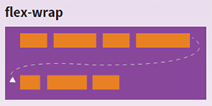
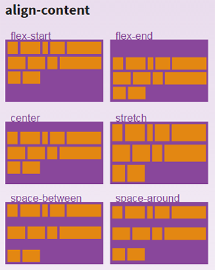

#### Topic
- [@media Query](#media-query)
- [CSS Rule](#css-rule)


- [ES5 & ES6](#es5--es6)
- [Javascript Bug & Solution](#javascript-bug--solution)
- [jQuery DOM HTML and Meta Tags](#jquery-dom-html-and-meta-tags)
- [Javascript Utility Code](#javascript-utility-code)
- [Javascript Useful Code](#javascript-useful-code)
- [THREE.JS](#threejs)
- [Location, Query](#location-query)
- [Google Map](#google-map)
- [Youtube](#youtube)
- [Google Analytic](#google-analytic)
- [Ajax, Form, Post, Get](#ajax-form-post-get)
- [PHP](#php)
- [Command - Linux, Windows](#command---linux-windows)
- [Useful Libraries](#useful-libraries)
- [Coding Reference Sites](#coding-reference-sites)
- [Online Learning Site](#online-learning-site)
- [Useful Links](#useful-links)
- [Coding Blogs](#coding-blogs)


<br><br><br>

# CSS - Reference


## +@media Query
```css
@media (min-width: 400px) and (max-width: 700px) { … }
@media (min-width: 20em) { … }
@media (orientation:portrait) { … }
@media (device-width < 800px) { … }
@media (device-aspect-ratio: 16/9) { … }
@media (device-aspect-ratio: 32/18) { … }
@media (device-aspect-ratio: 1280/720) { … }
@media (device-aspect-ratio: 2560/1440) { … }
@media (resolution >= 2dppx)
@media (grid) and (max-width: 15em) { … }
```
<br>

#### To change the background and text color in different lighting conditions you would write something like this
```css
@media (luminosity: normal) {
    body {
        background: #f5f5f5;
        color: #262626;
    }
}
@media (luminosity: dim) {
    body {
        background: #e9e4e3;
    }
}
@media (luminosity: washed) {
    body {
        background: #ffffff;
    }
}
```
<br>

 
#### For accessibility purposes, user agents may offer manual controls allowing the user to switch between the 3 levels of independently of the ambient light level, as high contrast or low contrast styles may be more suitable for users with visual disabilities.
```css 
@media (light-level: normal) {
  p { background: url("texture.jpg"); color: #333 }
}
@media (light-level: dim) {
  p { background: #222; color: #ccc }
}
@media (light-level: washed) {
  p { background: white; color: black; font-size: 2em; }
}
```

#### The media feature device-aspect-ratio only applies to visual devices. On an speech device, expressions involving device-aspect-ratio will therefore always be false:
```html
<link media="speech and (device-aspect-ratio: 16/9)" rel="stylesheet" href="example.css">
```
<br>


#### For accessibility reasons, even on devices whose pointing device can be described as fine, the UA may give a value of coarse or none to this media query, to indicate that the user has difficulties manipulating the input device accurately or at all.
Make radio buttons and check boxes larger if we have an inaccurate pointing device
```css
@media (pointer:coarse) {
  input[type="checkbox"], input[type="radio"] {
    min-width:30px;
    min-height:40px;
    background:transparent;
  }
}
```
<br>

#### For accessibility reasons, even on devices that do support hovering, the UA may give a value of hover: none to this media query, to opt into layouts that work well without hovering.
Only use a hover-activated drop down menu on devices that can hover.
```css
@media (hover) {
  .menu > li {display:inline-block;}
  .menu ul {display:none; position:absolute;}
  .menu li:hover ul {display:block; list-style:none; padding:0;}
}
```
<br><br><br>

# CSS Rule

- If two div nested in parent and child relation then child div cover parent div, to see parent div color, then give padding to parent div.

- Block element take full width of parent, if we give width less than parent div, then next sibling element will not come beside previous element.
- Inline Element always align next to each other
- Many elements has default margin and may change as per browser. To solve this use CSS Reset for cross-browser compatibility.
- Difference between display: block, inline, inline-block


- **Collapse or Overlap Margin** <br>
**Without Float** – : If two elements has margin 10px, then gap between them will be 10px, not 20px. Or whichever element has higher margin, gap will be that much.<br>
<br><br>
**With Float – :** If two elements has margin 10px, then gap between them will be 20px. In float margin never overlap, if two element has 10px and 20px then gap will 30px.<br> 
**margin-top:10px, <br> margin-bottom:10px**<br>
<br><br> 
margin-top:10px, <br> margin-bottom:10px <br> and .orange{margin-bottom:30px;}<br>
<br><br> 
margin-top:10px, <br> margin-bottom:10px <br> and .orange{margin-bottom:30px;}  <br> .green{margin-bottom:30px;}<br>
<br><br>
margin-top:10px, <br>margin-bottom:10px <br>and .orange{margin-right:30px} <br>
<br><br>
margin-top:10px, <br>margin-bottom:10px <br>and .orange{margin-bottom:30px; margin-right:30px} <br>
<br>

- **Padding and Margin Never Overlap -** <br>
if parent div has padding 10px and child div has margin 10px then inner gap between child and parent will be 20px; **this work same when child has float.** child has **margin-top:10px, margin-bottom:10px** and parent has **padding:10px** <br>
**without child float**<br>
<br><br>
**with child float**<br>
<br>

- First and Last Child Margin apply to Parent - if parent don’t have padding, border and overflow:hidden then first and last child margin apply to its parent child.
- Overflow:hidden and border  is help to parent div by restrict for applying child div margin to parent if parent div don’t have padding.
- If div tag are empty then it will not render and will not take space in html.
- Turn Inline element to block level by display:block; and block element to  inline by display:inline;
- Inline element you can’t give width, width not effect on inline element. if you give float:left to inline element then inline element start floating + start behaving like Block level element, now margin, overlap margin, width will work.
- If you give width:auto to block element, it will not expand according to child element,  its will always take parent width.
- if you give padding to Inline element and parent is block element then inline element expand more than parent height, expand from top and bottom, but parent div position never change from top and not effect of parent border, Border and Padding doesn’t solve this, Overflow hidden only mask expanded area but doesn’t solve this.<br> 


- if you give Margin to Inline element then only Left, Right margin will work     and     Top, Bottom margin will ignor<br>


- float left <br>
if Orange is block and float left element, and Green n Blue are only block element then float will work like below and all three are in child of one parent<br>
<br>
<br>
<br>
<br>
<br><br>
if Orange element float:right<br>
<br><br>
if Blue element given clear:left<br>
<br><br>
if one more Orange element added below to Blue element with same Orange styles<br>
<br><br>
if Blue element remove clear:left<br>
See, mark, observe in below and above – float element will start floating below after its previous block element, if previous is also float element then they reside side by side.<br>
<br><br>
if Blue is out of parent and Blue element remove clear:left <br>
<br>
<br><br>
if Blue element give clear:left, but white gap come<br>
<br><br>
to solove white gap give Red parent element overflow:hidden<br>
<br><br>
If we give float:left to element then clear:left will work,
ane if give float:right to element then clear:right will work,
to solve this use clear:both<br>
When a block-level element is floated, its width is calculated based on the width of the content inside it

- Box Model – Block element width increase according to  padding, border, margin.<br>


- To fix Box Model issue use box-sizing:border-box, if parent width:300px and 3 child has width:100px, padding:3px, float:left; then child width will be 103px by box modelling and last child will fall down,.<br>
<br>
<br>  
to solve this use box-sizing:border-box to child so child width be 100px including padding<br>
<br>
<br>

- **Absolute** <br>
if parent div has default property position:static and child div is position:absolute + doesn’t set top, left then it will align to parent div’s top left according to parent padding.<br>
<br>
check below, Orange div set position:absolute and doesn’t set top left<br>
<br>
check below, now Orange div set position:absolute and top:0px; left:0px;
in this case Orange div will check parent’s parent div position property,
if its relative or absolute then orange div will align to it
if not then again check parent’s parent till body.<br>
<br>
margin will apply to absolute element but will not work like overlap margin.
margin value will effect from left and top of that element

- Block Element are  **ul, Table,  div, dl, fieldset, form, h1, h2, h3, h4, h5, h6, hr, li, main, nav, address, blockquote, dd, noscript, ol, p, pre**
- Bolck HTML5 Element are **article, aside, canvas, figcaption, figure, footer, header, hgroup, tfoot, output, section, video**
- Inline Element **a, b, strong,  big, i, img, small, button, input, span, textarea, label, map, select,  acronym, cite, code, dfn, em, kbd, samp, time, var, bdo, br, object, q, script,  sub, sup**
<br><br><br>


# CSS Specificity
When two or more CSS selectors are sending conflicting instructions to a single html element, a choice must be made as to which styles to apply. This is done through CSS specificity.
Blow is given value for
```javascript
Style Attribute  = 1000
ID = 100
Class, pseudo-Class = 10
Elements = 1
```

**For Remeber**
```javascript
- - - - - - - - - - - - - - - - - - - - - - - -
Style Attribute          1    0    0    0
- - - - - - - - - - - - - - - - - - - - - - - - 
ID                            1    0    0
- - - - - - - - - - - - - - - - - - - - - - - -  
Class, pseudo-Class                1    0
- - - - - - - - - - - - - - - - - - - - - - - - 
Elements                                1
- - - - - - - - - - - - - - - - - - - - - - - - 
```

**Below is calculation**
```css
p   ➔   1
div    ➔ 1
#sidebar    ➔ 100
div#sidebar   ➔ (div - 1) + (#sidebar - 100)  ➔   100 + 1  ➔ 101
div#sidebar p   ➔ (div – 1) + (#sidebar  - 100) + (p – 1) ➔  1 + 100 + 1  ➔ 102
div#sidebar p.bio   ➔  (div – 1) + (#sidebar  - 100) + (p – 1) + (.bio – 10) ➔  112
```

```css
height:500px !important /*will ignore all css and set this important css*/
```
- - -  

<br><br>


# CSS Aligment

### Block Element’s inner content align center
```css
div {text-align:center;}
```
<br><br>
### Vertical and Horizontal Alignment
Horizontal Centering Block Level Elements
```css
div#container {margin:0 auto;}
```
<br><br>

### Vertical and Horizontal Centering Block Level Elements, 
left, top, margin-left, margin-top
```css
div#container {
    position: absolute; 
    top: 50%; left:50%; 
    width:800px; height: 500px; 
    margin-left: -400px;  margin-top: -250px;  border:#ff0000 solid thin;
}
```
<br><br>


### Vertical  and Horizontal Centering position:absolute
left, top, margin-left, margin-top
```css
.n_content{ 
    position:absolute; top:0; bottom:0;
    left:0; right:0;
    max-width:500px; height:200px; 
    margin:auto; 
    color:#fff;
}
```
<br><br>

### Vertical Centering Div Text with Line-Height
The HTML:
```html
<div id="container">some text here</div>
```
The CSS:
```css
div#container {height: 35px; line-height: 35px}
```
<br><br>


### Vertical Horizontal Center Div Text  with Padding, but increase button size according to text font size
```css
.parent{ 
    display: inline-block; 
    text-align:center; 
    padding: 10px 20px;  
    font-size: 50px;  
    background-color: #ff0000;
} 
```
```html
<a class="parent">Shailendra</a>
<a class="parent">more</a>
```
<br><br>


### Vertical Horizontal Center Div Text with “table” and “table-cell”, button size does not Increase according to text font size
CSS:
```css
.parent{
  display: table; width:350px; height:120px;
  margin: 2px; text-align:center; float: left;  
  background-color: #ff0000;
}
span{  
  display: table-cell;  
  vertical-align: middle;  
  font-size: 50px;
}
img{  
  vertical-align: middle;
}
```
HTML:
```html
<div class="parent">
  <span>Shailendra</span>
</div>
<div class="parent">
  <span>More</span>
  <span></span>
</div>
```
<br><br>


### Align Text and element Vertical bottom
```css
vertical-align: bottom;
```
----------
<br><br>

# Text and Font
### Text-transform
Through the CSS text-transform property you can make sure certain blocks of text are either uppercase, lowercase, or only the first letter of each word is uppercase
```css
p {text-transform: uppercase}
p {text-transform: lowercase}
p {text-transform: capitalize}
```
<br>

### Remove Dotted Outline on Links
Easy with the CSS outline property (underline, line, doted line)
```css
a {outline: none}
//or 
a {outline: 0}
```
The outline is useful for accessibility so think twice before turning it off completely. You may only want to set it for one of the specific link states mentioned above.

<br><br>
### Text font size increase according to Viewport Width and Height, in percentage
text increase according to Viewport Width
```css
.parent{
  font-size: 10vw;
}
```

Text increase according to Viewport Height
```css
.parent{
  font-size: 10vh;
};
```
<br><br>

### Prevent a Line Break
Sometimes the text in a link or heading will break where you don’t want it to. A simple way to prevent this is:
```css
h1 { white-space:nowrap; }
```

<br><br>

### Style the Element that has Focus in a Form
A nice usability tip is to let people filling out a form know which input currently has focus. You can do this easily using the :focus pseudo-selector
```css
input:focus {
  border: 2px solid green;
}
input:focus { 
  background-color: yellow;
}
```
This way your users will know exactly which field is ready for input


----------
<br><br>
# Image

### Removing the Border from Image Links
By default any image that is wrapped in a link will have a border around the image (similar to the way text is underlined). Removing the border is simple
```css
a image {border: none}
//or 
a image {border: 0}
```
Since I never want to see the border around image links I usually set the above on every site I develop.

----------
<br><br>
# Background 
### Background Images as List Bullets
Sometimes it’s nice to be able to use an image as a bullet instead of one of the supported list-style-types.
```css
ul {list-style: none}
ul li {
    background-image: url("path-to-your-image");
    background-repeat: none;
    background-position: 0 0.5em;
}
```


----------
<br><br>

# CSS Width and Height
### Increase Decrease width to Specific Limit
In below CSS width will increase and decrease according to parent width **below 800px.** Above parent width 800 element will stick to 800px;
```css
.imgC{
  display:block; margin:0 auto; height:auto;
  width:800px; max-width:100%;
}
```

In below CSS width will increase and decrease according to parent width **above 800px**. Above parent width 800 element will stick to 800px;
```css
.imgC{
  display:block; margin:0 auto; height:auto;
  width:800px; min-width:100%;
}
```
<br><br>

### 100% Height
When you specify an element to have a height of 100%, the 100% refers to the parent element’s height. The parent element would then need to be 100% the height of its parent element and so on. The trick is to set the height of the outermost elements to be 100%
```css
html, body {
  height: 100%
}
```
We need to add one more thing. If your content exceeds 100% height then it will overflow its container. To correct this we’d need to set min-height on the content’s container
```css
#content {
  min-height: 100%
}
```
You can use one of the methods above for serving min-height to IE.

<br><br>

### Change Height in proportion to Width of DIV
```html
//---- H T M L -----------
<div class="box" id="redBox">
    <div class="padder"></div>
</div>
```
```css
//---- C S S ----------
/*
Box div height will change in proportion to Box width
*/
.box {
    position:relative;
    width:300px;
    height:auto;
    background:url(../images/spritesheet-img.png);      
} 
/* if width 250px and height 300px then padding-bottom will be as per below.
padding-bottom = height*100/width
padding-bottom = 300*100/250
padding-bottom = 120           */
.padder{
  padding-bottom:120%;
}
```


----------
<br><br>

# CSS Viewport
### Viewport Meta Tag
```html
<meta name="viewport"
    content="width=device-width, height=device-height, maximum-scale=1.0, minimum-scale=1.0, initial-scale=1.0, user-scalable=no" />
```

<br><br>
### Block search indexing with 'noindex', stop crawling website
To prevent most search engine web crawlers from indexing a page on your site, place the following meta tag into the 
```html
<!DOCTYPE html>
<html>
  <head>
    <meta name="robots" content="noindex, nofollow">
  </head>
  <body></body>
</html>
```
----------
<br><br>

# CSS Floats
### Clearing and Containing Floats
There are two basic methods to clearing CSS floats. The first is to use the clear property
```html
<div id="wrapper">
  <div id="header"></div>
  <div id="content"></div>
  <div id="sidebar"></div>
  <div id="footer"></div>
</div>
```
Say in the above html you have your content and sidebar div floated to the left and you want to ensure the footer div sits below both. You would use the clear property
```css
#content {float: left}
#sidebar {float: left}
#footer {clear: both}
```

You could also use clear: left or clear: right depending on which way the content and sidebar are floated.

If on the other hand your html is:
```html
<div id="header">
	
	<p id="tagline"></p>
</div>
```
and both the logo and tagline are floated, your header div will collapse and show as having 0 height. You can either add an empty div 
```html
<div class="clear"></div>
```
 and then clear the empty div as above 
 
 or 
 
 you can use the overflow property on the header div to contain the floated elements
```css
div#header {overflow: hidden}
```
The above will keep the header div from collapsing even if everything inside has been floated.

----------
<br><br>

# Flex-Flow
https://css-tricks.com/snippets/css/a-guide-to-flexbox/

<br><br>
<br><br>
<br><br>
<br><br>
<br><br>
<br><br>
<br><br>


### Flex Occupy / Expand remain height
```css
.parent{
  display:flex; flex-direction: column;
  .topDiv{
    height:50px;
  }
  .bottomDiv{
    flex:1;
  }
}


```


----------
<br><br>

# Misc
### Visibility or Display?
On the surface both the CSS visibility and display properties seem to do the same thing, hide or show an element on the page. Beneath the surface they work differently.
```css
{visibility: hidden} – 
/*The element holds the space, but isn’t seen*/

{display: none} – 
/*The element does not hold space. Other elements collapse to fill the space*/
```
Most of the time you likely want to use display: none, unless your goal is to leave an empty open space on your page.

<br><br>

### nth-child
See also below link for more clarification : 
http://www.w3schools.com/cssref/sel_nth-child.asp, 
http://www.w3schools.com/jquery/sel_nthchild.asp
The nth-child CSS pseudo-selectors allow you to target the 3rd or 7th or nth element in a list. Another use would be to style odd and even rows in a table differently. The alternative is to add a class specifically to the list-item you want to style differently, but that’s not very flexible. The nth-child syntax looks like this:
```css
ul li:nth-child(3) {
    background: blue
}
```
The above would select the 3rd item in the list and give it a blue background
```css
ul li:nth-child(3n+3) {
    background: blue
}
```
Similarly the code above would style every 3rd list item with a blue background
Unfortunately no current version of IE supports it. However there is a way to simulate the 1st bit of code above for IE7 and IE8.
```css
ul > li:nth-child(3) is the same as ul > *:first-child + * + * 
```
The code above will also target the 3rd element in the list in a way that IE7 and 8 understand. Not quite as useful as being able to use (3n+3) to target every 3rd list-item, but better than nothing. Hopefully IE9 will support nth-child.
Another and perhaps more practical solution currently is to use jQuery, which supports all CSS3 selectors.

<br><br>

### Conditional Comments
Conditional comments are an ideal way to target IE browsers only, since IE is often the browser that won’t cooperate. The basic form of a conditional comments is:
```css
<!--[if IE]>
	<link rel="stylesheet" type="text/css" href="ie-stylesheet.css" />
< ![endif]-->
```
The above will load an IE specific stylesheet only when the browser viewing the page is Internet Explorer. You can further target specific versions of IE.
```css
<!--[if IE 6]> - targets IE6 only -->
<!--[if gt IE 6]> - targets IE7 and above -->
<!--[if lt IE 6]> - targets IE5.5 and below -->
<!--[if gte IE 6]> - targets IE6 and above -->
<!--[if lte IE 6]> - targets IE6 and below -->
```
You can specify any version of Internet Explorer and through a combination of conditional comments you can server different CSS styles to different versions of IE.

<br><br>


### HTML Hack for IE
Another way to target IE specifically is to use the HTML * hack. Internet Explorer allows you to use something other than the html element as the root of your document. By placing an * in front of html in your CSS (*html) you can target IE only as other browsers will ignore the declaration.
div#content {width: 580px}
```css
*` html body div#content {width: 600px}
```
IE will use 600px for the width of the content div, while other browsers use 580px. The above works for IE6 and below. When not in standards mode, but in quirks mode this will work on IE7 as well. You can also target IE7 (in quirks mode) specifically with
```css
*+html body div#content {width: 620px}
```

<br><br>

### Target IE7 (and below) and IE6 (specifically) without Conditional Comments
We all know how difficult IE can sometimes be when it comes to CSS. However instead of cursing IE under your breath or out loud you can easily write IE specific code that other browsers will ignore. My own preference is for conditional comments, but here’s a quick trick you can use in your main CSS file.
```css
.element {
    background: red; /* modern browsers */
    *background: green; /* IE 7 and below */
    _background: blue; /* IE6 exclusively */
}
```
With the exception of IE, all browsers will ignore the asterisk in front of the property. Everything other than IE6 will ignore the underscore. The order of the above properties is very important due to CSS precedence rules.

<br><br>

### Min-height fix for IE
Sadly IE still doesn’t comply with min-height. However it does treat the height property as though it was min-height. Knowing that, we can sort of get min-height working in Internet Explorer.
```css
.element {
    min-height: 500px
    height: auto !important
    height: 500px
}
```
The first line above sets the min-height for non-IE browsers. The last line essentially sets min-height in IE as IE will treat height as we expect it to treat min-height. The middle line above is to ensure that non-IE browsers don’t use 500px as the height of the element. Using !important will override the height declaration below in all browsers, except IE.
Another way to target IE only is to use _height. Only IE6 will treat _height as height. All other browsers will ignore it. You have to specify _height after any height declaration as IE will use whichever comes last.
```css
.element {
    min-height: 500px
    _height: 500px
}
```


### Mouse click (or touch) events on canvas causes selection drag
```css
#canvas {
	-webkit-tap-highlight-color: transparent;
}
```
<br><br>

### Avoid Ghost Image Selection
```css
.noselect {
	-webkit-touch-callout: none;
	-webkit-user-select: none;
	-khtml-user-select: none;
	-moz-user-select: none;
	 -ms-user-select: none; 
	-o-user-select: none; 
	user-select: none;
	outline: none; 
	text-decoration:none; 
	outline:none; 
	outline-color:none;
}
```
<br><br>


### Using a CSS Reset for Cross-Browser Compatibility
One of the issues in cross-browser web development is that different browsers use different default values for various CSS properties. By explicitly setting a property like margin to be 0 for certain html elements we can assure that the margin will be 0 on that element in all browsers.
Using a CSS reset ensure that all browsers are on the same page so to speak.
```css
*{
	margin:0; padding:0;
}
```
**//---- or ---------**
```css
*{ -webkit-box-sizing: border-box;   -moz-box-sizing: border-box;  box-sizing: border-box;}
h1, h2, h3, h4, h5, h6, p, div, ul { margin:0; padding:0; font-weight:normal; line-height:100%;}
a{ text-decoration:none; outline:none; }
*:focus{outline:none;}
ul{list-style:none;}
img { border:0; vertical-align:middle;}
body { margin:0; padding:0; font-family:'FuturaLtBTLight', Arial, Helvetica, sans-serif; color:#ffffff; width:100%;  }
input[type="button"]{cursor:pointer;}
.clear { clear:both; margin:0; padding:0; }
.clearfix:after {content: " "; /* Older browser do not support empty content */ visibility: hidden; display: block; height: 0; clear: both;}

.overFlow{ overflow-x:hidden;}
svg, canvas{ pointer-events: none;}
p{ font-size:14px; line-height:27px; color:#393939;}
.f-left{float:left;}
.f-right{float:right;}
.Text-align-left{ text-align:left;}
.Text-align-right{ text-align:right;}

```
<br><br>

### 3D Buttons with CSS Only
```css
div#button {
  background: #888; 
  border: 1px solid; 
  border-color: #999 #777 #777 #999;
}
```

<br><br>
### CSS Tooltips

You can create a lightweight CSS cross browser tooltip easily with a few lines of code.
This is the  `<a class="tooltip" href="#">Tooltip Link<span>` This will be the text that shows up in the tooltip`</span></a>` You can place any text you want here.
The CSS:
```css
a.tooltip {position: relative}
a.tooltip span {display:none; padding:5px; width:200px;}
a:hover {background:#fff;} /*background-color is a must for IE6*/
a.tooltip:hover span{display:inline;  position:absolute;}
```
You can add more styles to the above to suit your design. The key is the span is set to display: none until you hover over the link. When you hover over the link the display is changed to show inline and given a position of absolute. position: relative is necessary on the link in order to ensure the tooltip is positioned in relation to the link and not another containing element.


<br><br>
### Video Tag and its Parameter
below code help to auto play video in mobile them
```html
<video class="contact-video" poster="img/team-poster.jpg" data-object-fit="cover" muted  loop  webkit-playsinline  playsinline >
<source src="img/Team_low.mp4" type="video/mp4">
Your browser does not support the video tag.
</video>
```


----------
<br><br><br><br><br><br>

# ES5 & ES6

## [Recursion - Return Sub of Array](https://www.freecodecamp.org/learn/javascript-algorithms-and-data-structures/basic-javascript/replace-loops-using-recursion)
```javascript
/*
A recursive function that returns 
the sum of the first n elements of an array arr
*/
function sum(arr, n) {
  if(n <= 0) {
    return 0;
  } else {
    return sum(arr, n - 1) + arr[n - 1];
  }
}
sum([1], 0)           // return 0
sum([2, 3, 4], 1)     // return 2
sum([2, 3, 4, 5], 3)  // return 9
```


<br><br><br>


## [Recursion - to Create a Countdown](https://www.freecodecamp.org/learn/javascript-algorithms-and-data-structures/basic-javascript/use-recursion-to-create-a-range-of-numbers)
```javascript
function countup(n) {
  if (n < 1) {
    return [];
  } else {
    const countArray = countup(n - 1);
    countArray.push(n);
    return countArray;
  }
}
console.log(countup(5));
// The value [1, 2, 3, 4, 5] will be displayed in the console.
```


<br><br><br>


## [Recursion - to Create a Range of Numbers](https://www.freecodecamp.org/learn/javascript-algorithms-and-data-structures/basic-javascript/use-recursion-to-create-a-countdown)
```javascript

/*
rangeOfNumbers(1, 5) should return [1, 2, 3, 4, 5]
rangeOfNumbers(6, 9) should return [6, 7, 8, 9]
rangeOfNumbers(4, 4) should return [4]
*/
// Solution 1
function rangeOfNumbers(startNum, endNum) {
  if (endNum - startNum === 0) {
    return [startNum];
  } else {
    var numbers = rangeOfNumbers(startNum, endNum - 1);
    numbers.push(endNum);
    return numbers;
  }
}

// Solution 2
function rangeOfNumbers(startNum, endNum) {
  return startNum === endNum
    ? [startNum]
    : rangeOfNumbers(startNum, endNum - 1).concat(endNum);
}

// Solution 3
function rangeOfNumbers(startNum, endNum) {
  return startNum === endNum
    ? [startNum]
    : [...rangeOfNumbers(startNum, endNum - 1), endNum ];
}
// The value [1, 2, 3, 4, 5] will be displayed in the console.
```


<br><br><br>


## [Prevent Object Mutation](https://www.freecodecamp.org/learn/javascript-algorithms-and-data-structures/es6/prevent-object-mutation)
JavaScript provides a function Object.freeze to prevent data mutation.
Once the object is frozen, you can no longer add, update, or delete properties from it. Any attempt at changing the object will be rejected without an error.
```javascript
let obj = {
  name:"FreeCodeCamp",
  review:"Awesome"
};

Object.freeze(obj);

obj.review = "bad";
obj.newProp = "Test";
console.log(obj); 
/*
The obj.review and obj.newProp assignments will result 
in errors, and the console will display the value 
{ name: "FreeCodeCamp", review: "Awesome" }.
*/
```

<br><br><br>


## Arrow Function
```javascript
const myFunc = () => {
  const myVar = "value";
  return myVar;
}

// without parameter
const myFunc = () => "value";

// If an arrow function has a single parameter,
const doubler = (item) => item * 2;
const doubler = item => item * 2;

// pass more than one parameter 
const multiplier = (item, multi) => item * multi;

// default parameters for functions
const greeting = (name = "Anonymous") => "Hello " + name;
console.log(greeting("John"));
console.log(greeting());

// Use the Rest Parameter with Function Parameters
function howMany(...args) {
  return "You have passed " + args.length + " arguments.";
}
console.log(howMany(0, 1, 2));
console.log(howMany("string", null, [1, 2, 3], { }));

```


<br><br><br>


## Concise Declarative Functions with ES6
```javascript
//--  ES5 --------
const person = {
  name: "Taylor",
  sayHello: function() {
    return `Hello! My name is ${this.name}.`;
  }
};
//--  ES6 --------
// With ES6, you can remove the function keyword and 
// colon altogether when defining functions in objects
const person = {
  name: "Taylor",
  sayHello() {
    return `Hello! My name is ${this.name}.`;
  }
};

```


<br><br><br>


## Class
```javascript
//---  js/spaceShuttle.js  ---
class SpaceShuttle {
  constructor(targetPlanet) {
    this.targetPlanet = targetPlanet;
  }
}
// export variable or function to use in another file
export{SpaceShuttle} 

const zeus = new SpaceShuttle('Jupiter');


//---  ./js/math_functions.js  ---
const add = (x, y) => {
  return x + y;
}
const subtract = (x, y) => {
  return x - y;
}
//  You can export multiple things by repeating export 
export{add}
export{subtract}
// or by placing them all in the export statement
export {add, subtract };


// Getters and Setters
//---  js/book.js  ---
// you can only have one value be a 'default export' in 
// each module or file. Additionally, you cannot use 
// export default with var, let, or const
export default class Book {
  constructor(author) {
    this._author = author;
  }
  // getter
  get writer() {
    return this._author;
  }
  // setter
  set writer(updatedAuthor) {
    this._author = updatedAuthor;
  }
}

const novel = new Book('anonymous');
console.log(novel.writer);
novel.writer = 'newAuthor';
console.log(novel.writer);
```
```html
<!-- 
A script that uses type="module" can now use 
the import and export features of ES6
Note: all code execute inside of /js/spaceShuttle.js
Example: Console.log written outside of class
 -->
<script type="module" src="./js/spaceShuttle.js"></script>

<!-- or import in html using script tag and 
initialize inside script tag it -->
<script  type="module" >
   import {SpaceShuttle} from './js/spaceShuttle.js';
   const zeus = new SpaceShuttle('Jupiter');
</script>
```
```javascript
// import
import add from "./math_functions.js";

/* 
Use * to Import Everything from a File.
The above import statement will create an object called 
myMathModule. This is just a variable name, you can name it
anything. The object will contain all of the exports from 
math_functions.js
*/
import * as myMathModule from "./js/math_functions.js";
myMathModule.add(2,3);
myMathModule.subtract(5,3);
```


<br><br><br>


## Array and Spread Operator
```javascript
const arr = [6, 89, 3, 45];
const maximus = Math.max(...arr);

```

<br><br><br>


## Array
#### [Array.concat()](https://developer.mozilla.org/en-US/docs/Web/JavaScript/Reference/Global_Objects/Array/concat)
The concat() method is used to merge two or more arrays. This method does not change the existing arrays, but instead returns a new array
```javascript
let newArray = [1, 2, 3].concat([4, 5, 6]);
// output - [1, 2, 3, 4, 5, 6].
```
<br>

#### [Array.slice()](https://developer.mozilla.org/en-US/docs/Web/JavaScript/Reference/Global_Objects/Array/slice)
The slice() method returns a shallow copy of a portion of an array into a new array object selected from start to end (end not included) where start and end represent the index of items in that array. **The original array will not be modified.**
```javascript
// slice()
// slice(start)
// slice(start, end)

let fruits = ['Banana', 'Orange', 'Lemon', 'Apple', 'Mango']
let citrus = fruits.slice(1, 3)
// fruits -  ['Banana', 'Orange', 'Lemon', 'Apple', 'Mango']
// citrus -  ['Orange','Lemon']

// copy array using slice method
let citrusCopied = fruits.slice();
// citrusCopied -  ['Banana', 'Orange', 'Lemon', 'Apple', 'Mango']
```
<br>

#### [Array.splice()](https://developer.mozilla.org/en-US/docs/Web/JavaScript/Reference/Global_Objects/Array/splice)
The splice() method changes the contents of an array by **removing or replacing** existing elements and/or adding new elements in place. To access part of an array without modifying it, see slice().
```javascript
// splice(start)
// splice(start, deleteCount)
// splice(start, deleteCount, item1)
// splice(start, deleteCount, item1, item2, itemN)

let myFish = ['angel', 'clown', 'mandarin', 'sturgeon']
let removed = myFish.splice(2, 0, 'drum')
// myFish -  ["angel", "clown", "drum", "mandarin", "sturgeon"]
// removed -  [], no elements removed

let myFish = ['angel', 'clown', 'drum', 'mandarin', 'sturgeon']
let removed = myFish.splice(3, 1)
// myFish - ["angel", "clown", "drum", "sturgeon"]
// removed - ["mandarin"]

let myFish = ['angel', 'clown', 'drum', 'sturgeon']
let removed = myFish.splice(2, 1, 'trumpet')
// myFish - ["angel", "clown", "trumpet", "sturgeon"]
// removed - ["drum"]
```
<br>

#### [Array.filter()](https://developer.mozilla.org/en-US/docs/Web/JavaScript/Reference/Global_Objects/Array/filter)
The filter() method creates a new array with all elements that pass the test implemented by the provided function. Filter Array
```javascript
const words = ['spray', 'limit', 'elite', 'exuberant', 'destruction', 'present'];
const result = words.filter(word => word.length > 6);
console.log(result);
// expected output: Array ["exuberant", "destruction", "present"]
//
//
// Arrow function
Array.filter((element) => { ... } )
Array.filter((element, index) => { ... } )
Array.filter((element, index, array) => { ... } )
/* 
element : The current element being processed in the array.
index   : The index of the current element being processed in the array.
array   : The array filter was called upon.
*/
```
<br>

#### [Array.map()](https://developer.mozilla.org/en-US/docs/Web/JavaScript/Reference/Global_Objects/Array/map)
The map() method creates a new array populated with the results of calling a provided function on every element in the calling array
```javascript
const users = [
  { name: 'John', age: 34 },
  { name: 'Amy', age: 20 },
  { name: 'camperCat', age: 10 }
];
const names = users.map(user => user.name);
console.log(names);
// expected output: [ 'John', 'Amy', 'camperCat' ]

const array1 = [1, 4, 9, 16];
const map1 = array1.map(x => x * 2);
console.log(map1);
// expected output: Array [2, 8, 18, 32]

// Arrow function
map((element) => { ... } )
map((element, index) => { ... } )
map((element, index, array) => { ... } )
```
<br>

#### [Array.reduce()](https://developer.mozilla.org/en-US/docs/Web/JavaScript/Reference/Global_Objects/Array/reduce)
The reduce() method executes a reducer function (that you provide) on each element of the array, resulting in a single output value.
```javascript
// reduce((accumulator, currentValue) => { ... } )
// reduce((accumulator, currentValue, index) => { ... } )
// reduce((accumulator, currentValue, index, array) => { ... } )
// reduce((accumulator, currentValue, index, array) => { ... }, initialValue)
//-----
// if initialValue value not supplied then iteration will start 
// from second index and accumulator will be first element of array
//-----

const array1 = [1, 2, 3, 4];
const sum = array1.reduce((accumulator, currentValue) => accumulator + currentValue);
// sum - 10

const users = [
  { name: 'John', age: 34 },
  { name: 'Amy', age: 20 },
  { name: 'camperCat', age: 10 }
];
const sumOfAges = users.reduce((sum, user) => sum + user.age, 0);
console.log(sumOfAges);  
// output - 64

const users = [
  { name: 'John', age: 34 },
  { name: 'Amy', age: 20 },
  { name: 'camperCat', age: 10 }
];
const sumOfAges = users.reduce((sum, user) => sum + user.age, 0);
console.log(sumOfAges);  
// output - 64

const users = [
  { name: 'John', age: 34 },
  { name: 'Amy', age: 20 },
  { name: 'camperCat', age: 10 }
];
const usersObj = users.reduce((obj, user) => {
  obj[user.name] = user.age;
  return obj;
}, {});
console.log(usersObj);
// output - { John: 34, Amy: 20, camperCat: 10 }.
```
<br>

#### [Array.every()](https://developer.mozilla.org/en-US/docs/Web/JavaScript/Reference/Global_Objects/Array/map)
The every() method tests whether all elements in the array pass the test implemented by the provided function. It returns a Boolean value.
```javascript
// every((element) => { ... } )
// every((element, index) => { ... } )
// every((element, index, array) => { ... } )

var numbers = [1, 5, 8, 0, 10, 11];
var boolean = numbers.every(function(element) {
  return element < 10;
});
console.log(boolean) // false
```
<br>

#### [Array.some()](https://developer.mozilla.org/en-US/docs/Web/JavaScript/Reference/Global_Objects/Array/map)
The some() method tests whether at least one element in the array passes the test implemented by the provided function. It returns true if, in the array, it finds an element for which the provided function returns true; otherwise it returns false. It doesn't modify the array.
```javascript
// some((element) => { ... } )
// some((element, index) => { ... } )
// some((element, index, array) => { ... } )

var numbers = [10, 50, 8, 220, 110, 11];
var boolean = numbers.some(function(currentValue) {
  return currentValue < 10;
});
console.log(boolean) // true
```

<br>

#### [Array.sort()](https://developer.mozilla.org/en-US/docs/Web/JavaScript/Reference/Global_Objects/Array/sort)
The sort() method sorts the elements of an array in place and returns the sorted array
```javascript
// Number Sorting
let numbers = [4, 2, 5, 1, 3];
numbers.sort((a, b) => a - b);
console.log(numbers);
// [1, 2, 3, 4, 5]
//
//
// Number and String Sorting
var items = [
  { name: 'Edward', value: 21 },
  { name: 'Sharpe', value: 37 },
  { name: 'And', value: 45 },
  { name: 'The', value: -12 },
  { name: 'Magnetic', value: 13 },
  { name: 'Zeros', value: 37 }
];
// sort by value
items.sort(function (a, b) {
  return a.value - b.value;
});
// sort by name
items.sort(function(a, b) {
  var nameA = a.name.toUpperCase(); // ignore upper and lowercase
  var nameB = b.name.toUpperCase(); // ignore upper and lowercase
  if (nameA < nameB) {
    return -1;
  }
  if (nameA > nameB) {
    return 1;
  }
  // names must be equal
  return 0;
});
```


<br><br><br>


## Destruction
```javascript
// Extract Values from Objects
const user = { name: 'John Doe', age: 34 };
const { name, age } = user;

// Extract and give new variable names in the assignment
const user = { name: 'John Doe', age: 34 };
const { name: userName, age: userAge } = user;

// Assign Variables from Nested Objects Passed
const user = {
  johnDoe: { 
    age: 34,
    email: 'johnDoe@freeCodeCamp.com'
  }
};
const { johnDoe: { age, email }} = user;
const { johnDoe: { age: userAge, email: userEmail }} = user;


// Destructuring an array lets us do exactly that:
const [a, b] = [1, 2, 3, 4, 5, 6];
console.log(a, b); // The console will display the values of a and b as 1, 2.

// Destructuring by using commas to reach the desired index
const [a, b,,, c] = [1, 2, 3, 4, 5, 6];
console.log(a, b, c);
// The console will display the values 
// of a, b, and c as 1, 2, 5.

// Destructuring Assignment with 
// the Rest Parameter to Reassign Array
const [a, b, ...arr] = [1, 2, 3, 4, 5, 7];
console.log(a, b);
console.log(arr);
// The console would display the values 1, 2 and [3, 4, 5, 7].

// Copy Array using Destruction
let array = [1, 2, 3, 4, 5, 7];
let copyArray = [...array];


// Destructuring Assignment to Pass an Object as a Function's Parameters
const update = ({name, age, nationality, location}) => {
    console.log(name, age, nationality, location)
}
update({name:"shailendra", age:43, location:"Mumbai"})

```


<br><br><br>


## Create Strings using Template Literals
Template literals allow you to create multi-line strings and to use string interpolation features to create strings.
```javascript
const person = {
  name: "Zodiac Hasbro",
  age: 56
};

const greeting = `Hello, my name is ${person.name}!
I am ${person.age} years old.`;

console.log(greeting);
```


<br><br><br>


## Promises and Asynchronous Programming
A promise is a placeholder for the result of an asynchronous operation. Instead of subscribing to an event or passing a callback to a function, the function can return a promise
```javascript
//----------------------

let promise = new Promise(function(resolve, reject) {
	console.log("Promise");
    let isFileReceived = true;
    if(isFileReceived){        
	    resolve("received file");
    }else{        
	    reject("fail to receive file");
    }
});

promise.then(function(msg) {
	console.log("Resolved - ", msg);
    // "Resolved - received file"
}, function(msg) {
	console.log("Reject - ", msg);
    // "Reject - fail to receive file"
});
//  The previous example is equivalent to:
promise.then(function(msg) {
	console.log("Resolved - ", msg);
    // "Resolved - received file"
}).catch(function(msg) {
	console.log("Reject - ", msg);
    // "Reject - fail to receive file"
});


//----------------------


// Executor Errors
// If an error is thrown inside an executor, 
// then the promise’s rejection handler is called. For example: 

let promise = new Promise(function(resolve, reject) {
	throw new Error("Explosion!");
});
promise.catch(function(error) {
	console.log(error.message); 	// "Explosion!"
});
//--- The previous example is equivalent to:
let promise = new Promise(function(resolve, reject) {
	try {
    	throw new Error("Explosion!");
	} catch (ex) {
    	reject(ex);
	}
});
promise.catch(function(error) {
	console.log(error.message); 	// "Explosion!"
});


//----------------------


// Chaining Promises
// Each call to then() or catch() actually creates and 
// returns another promise. This second promise is resolved
// only once the first has been fulfilled or rejected.

let p1 = new Promise(function(resolve, reject) {
	resolve(42);
});

p1.then(function(value) {
	console.log(value);      	// calling sequence - 1
}).then(function() {
	console.log("Finished-1");   // calling sequence - 3
}).then(function() {
	console.log("Finished-2");   // calling sequence - 5
});

p1.then(function(value) {
	console.log(value+" Other");  // calling sequence - 2
}).then(function() {
	console.log("Finished-1 Other");   // calling sequence - 4
})
/*---The code outputs:
42
42 Other
Finished-1
Finished-1 Other
Finished-2
*/


//----------------------


// Catching Errors
// Promise chaining allows you to catch errors that may
// occur in a fulfillment or rejection handler from a 
// previous promise. For example:
let p1 = new Promise(function(resolve, reject) {
	resolve(42);
});

p1.then(function(value) {
	throw new Error("Boom!");
}).catch(function(error) {
	console.log(error.message); 	// "Boom!"
});
 
// The same is true if a rejection handler throws an error:
let p1 = new Promise(function(resolve, reject) {
	throw new Error("Explosion!");
});

p1.catch(function(error) {
	console.log(error.message);   // "Explosion!"
	throw new Error("Boom!");	 // if this line commented then below catch will not call
}).catch(function(error) {
	console.log(error.message);   // "Boom!"
});


//----------------------


// Returning Values in Promise Chains
// Another important aspect of promise chains is the ability to pass
// data from one promise to the next. You’ve already seen that a value
// passed to the resolve() handler inside an executor is passed to the
//  fulfillment handler for that promise. You can continue passing data 
// along a chain by specifying a return value from the fulfillment handler.

let p1 = new Promise(function(resolve, reject) {
	resolve(42);
});

p1.then(function(value) {
	console.log(value);     	// "42"
	return value + 1;
}).then(function(value) {
	console.log(value);     	// "43"
});
 
// You could do the same thing with the rejection handler. When a 
// rejection handler is called, it may return a value. If it does, 
// that value is used to fulfill the next promise in the chain, 
// like this:
let p1 = new Promise(function(resolve, reject) {
	reject(42);
});
 
p1.catch(function(value) {
	console.log(value);     	// "42"
	return value + 1;
}).then(function(value) {
	console.log(value);     	// "43"
});


//----------------------


// Returning Promises in Promise Chains
// Returning primitive values from fulfillment and rejection handlers allows 
// passing of data between promises, but what if you return an object? If the 
// object is a promise, then there’s an extra step that’s taken to determine 
// how to proceed. Consider the following example:

let p1 = new Promise(function(resolve, reject) {
	resolve(42);
});
let p2 = new Promise(function(resolve, reject) {
	resolve(43);
});

p1.then(function(value) {
	// first fulfillment handler
	console.log(value);     // 42
	return p2;
}).then(function(value) {
	// second fulfillment handler
	console.log(value); 	// 43
});

// previous example equivalent to this:
let p1 = new Promise(function(resolve, reject) {
	resolve(42);
});
let p2 = new Promise(function(resolve, reject) {
	resolve(43);
});
let p3 = p1.then(function(value) {
	// first fulfillment handler
	console.log(value); 	// 42
	return p2;
});
p3.then(function(value) {
	// second fulfillment handler
	console.log(value); 	// 43
});
 
// Here, it’s clear that the second fulfillment handler is attached to p3 
// rather than p2. This is a subtle but important distinction, as the second 
// fulfillment handler will not be called if p2 is rejected. For instance:

let p1 = new Promise(function(resolve, reject) {
	resolve(42);
});
let p2 = new Promise(function(resolve, reject) {
	reject(43);
});

p1.then(function(value) {
	// first fulfillment handler
	console.log(value); 	// 42
	return p2;
}).then(function(value) {
	// second fulfillment handler
	console.log(value);	 // never called
}, function(value) {
	// second rejection handler
	console.log(value); 	// 43
});

// In this example, the second fulfillment handler is never called because p2 
// is rejected. You could, however, attach a rejection handler instead:

let p1 = new Promise(function(resolve, reject) {
	resolve(42);
});
let p2 = new Promise(function(resolve, reject) {
	reject(43);
});

p1.then(function(value) {
	// first fulfillment handler
	console.log(value); 	// 42
	return p2;
}).catch(function(value) {
	// rejection handler
	console.log(value); 	// 43
}); 


//----------------------


// Returning thenables simply allows you to define additional responses to the 
// promise results. You defer the execution of fulfillment handlers by 
// creating a new promise within a fulfillment handler. For example:

let p1 = new Promise(function(resolve, reject) {
	resolve(42);
});
p1.then(function(value) {
	console.log(value); 	// 42
	// create a new promise
	let p2 = new Promise(function(resolve, reject) {
    	resolve(43);
	});
	return p2
}).then(function(value) {
	console.log(value); 	// 43
});


//----------------------

 
// Responding to Multiple Promises
// The Promise.all() Method
// The Promise.all() method accepts a single argument, which is an iterable 
// (such as an array) of promises to monitor,

let p1 = new Promise(function(resolve, reject) {
  setTimeout(function(){ resolve(10); }, 1000)
});
let p2 = new Promise(function(resolve, reject) {
  setTimeout(function(){ resolve(0.5); }, 500)
});
let p3 = new Promise(function(resolve, reject) {
  setTimeout(function(){ resolve(20); }, 4000)
});
let p4 = Promise.all([p1, p2, p3]);

p4.then(function(value) {
    // This fulfillment handler will call on all Promises 
    // resolved (after 4 second)
	console.log(Array.isArray(value));  // true
	console.log(value[0]);          	// 10
	console.log(value[1]);          	// 0.5
	console.log(value[2]);          	// 20
});
 
// If any promise passed to Promise.all() is rejected, the returned promise is
// immediately rejected without waiting for the other promises to complete:
let p1 = new Promise(function(resolve, reject) {
  setTimeout(function(){ resolve(10); }, 1000)
});
let p2 = new Promise(function(resolve, reject) {
  setTimeout(function(){ reject(0.5); }, 500)
});
let p3 = new Promise(function(resolve, reject) {
  setTimeout(function(){ resolve(20); }, 4000)
});
let p4 = Promise.all([p1, p2, p3]);

p4.then(function(value) {
    // will not call
	console.log(Array.isArray(value)); 
	console.log(value[0]);          	
	console.log(value[1]);          	
	console.log(value[2]);          	
}).catch(function(value) {
    // The rejection handler for p4 is called immediately without 
    // waiting for p1 or p3 to finish executing (after 0.5 Second)
	console.log(Array.isArray(value))   // false
	console.log(value);             	// 0.5
});
// The rejection handler always receives a single value rather than an array,
// and the value is the rejection value from the promise that was rejected.


//----------------------

 
// The Promise.race() Method
// When resolve first Promise
// As like race who will come first will be winner, like that which Promise 
// handler call first (resolve or reject) will trigger their haldler
// (fulfilment or catch) and other Promise handler will ignore. The returned 
// promise is settled as soon as the first promise is settled. Instead of 
// waiting for all promises to be fulfilled
let p1 = new Promise(function(resolve, reject) {
  setTimeout(function(){ resolve(10); }, 1000)
});
let p2 = new Promise(function(resolve, reject) {
  setTimeout(function(){ resolve(0.5); }, 500)
});
let p3 = new Promise(function(resolve, reject) {
  setTimeout(function(){ resolve(20); }, 4000)
});
let p4 = Promise.race([p1, p2, p3]);

p4.then(function(value) {
    // This p2 fulfillment handler will call only one time 
    // when p2 resolved (after 0.5 second). Other will not call
	console.log(value);          	// 0.5
});
 
 
// When reject first Promise
// The returned promise is settled as soon as the first promise is settled. 
// Instead of waiting for all promises to be fulfilled
let p1 = new Promise(function(resolve, reject) {
  setTimeout(function(){ resolve(10); }, 1000)
});
let p2 = new Promise(function(resolve, reject) {
  setTimeout(function(){ reject(0.5); }, 500)
});
let p3 = new Promise(function(resolve, reject) {
  setTimeout(function(){ resolve(20); }, 4000)
});
let p4 = Promise.race([p1, p2, p3]);

p4.then(function(value) {
    // will not call
	console.log(value);
}, function(value) {
    // This p2 reject handler will call only one time when p2 reject 
    // (after 0.5 second). Other will not call
	console.log(value);          	// 0.5
});


//----------------------

 
// Inheriting from Promises
// Just like other built-in types, you can use a promise as the base for a 
// derived class. The success() method mimics resolve() and failure() mimics 
// the reject() method
class MyPromise extends Promise {
	// create custom then function by name success
	success(resolve, reject) {
    	return this.then(resolve, reject);
	}
	// create custom catch or reject function by name failure
	failure(reject) {
    	return this.catch(reject);
	}
}
let promise = new MyPromise(function(resolve, reject) {
	resolve(42);
});

promise.success(function(value) {
	console.log(value);         	// 42
}).failure(function(value) {
	console.log(value);
});
```


<br><br><br>


## Regular expressions
```javascript
let result = "Hello, World!".test(/Hello/);
// or 
let myString = "Hello, World!";
let myRegex = /Hello/;
let result = myRegex.test(myString);
console.log(myRegex.test(myString)); // true
```
<br>

#### Match a Literal String with Different Possibilities
```javascript
let petString = "James has a pet cat.";
let petRegex = /dog|cat|bird|fish/;
let result = petRegex.test(petString);
console.log(result) // true
```

#### Ignore Case While Matching
```javascript
// The i flag use to ignore uppercase letters and lowercase. 
// You can use it by appending it to the regex.
let myString = "Hello, World!";
let fccRegex = /hello, world!/i; // Change this line
let result = fccRegex.test(myString);
console.log(result); // true
```
<br>

#### Extract Matches
```javascript
// Extract the actual matches you found with the .match() method.
"Hello, World!".match(/Hello/);  
/* --- output ---
[ 'Hello', 
  index: 0, 
  input: 'Hello, World!', 
  groups: undefined ] */
//
let ourStr = "Regular expressions";
let ourRegex = /expressions/;
ourStr.match(ourRegex);
/* -- output --
[ 'expressions',
  index: 8,
  input: 'Regular expressions',
  groups: undefined ] 
*/
```
<br>

#### Find More Than the First Match
```javascript
// To search or extract a pattern more than once, 
// you can use the g flag.
let twinkleStar = "Twinkle, twinkle, little star";
let result_1 = twinkleStar.match(/Twinkle/g);
let result_2 = twinkleStar.match(/Twinkle/ig);
console.log(result_1);   // [ 'Twinkle' ]
console.log(result_2);   // [ 'Twinkle', 'twinkle' ]
```
<br>

#### Match Anything with Wildcard Period
```javascript
// The wildcard character . (dot) will match any one character.
// You can use the wildcard character just like any other 
// character in the regex. For example, if you wanted to match 
// hug, huh, hut, and hum, you can use the regex /hu./ to match 
// all four words.
/hu./.test("I'll hum a song")  // true
/hu./.test("I'll hu a song")  // true
/hu./.test("I'll humm a song")  // true
/hu. /.test("I'll humm a song")  // false
/ hu./.test("I'll hhu a song")   // false
/.un/.test("Have fun with friends!")  // true
/ .un/.test("Have ffun with friends!")  // false
/ ..un/.test("Have ffun with friends!")  // true
```
<br>

#### Match Single Character with Multiple Possibilities
```javascript
// You want to match bag, big, and bug but not bog. 
// You can create the regex /b[aiu]g/ to do this. 
// The [aiu] is the character class that will only match 
// the characters a, i, or u.
let bigStr = "big";
let bagStr = "bag";
let bugStr = "bug";
let bogStr = "bog";
let bgRegex = /b[aiu]g/;
bigStr.match(bgRegex);  // ["big"]
bagStr.match(bgRegex);  // ["bag"]
bugStr.match(bgRegex);  // ["bug"]
bogStr.match(bgRegex);  // null
```
<br>

#### Match Single Character with Multiple Possibilities
```javascript
// You want to match bag, big, and bug but not bog. 
// You can create the regex /b[aiu]g/ to do this. 
// The [aiu] is the character class that will only match 
// the characters a, i, or u.
let bigStr = "big";
let bagStr = "bag";
let bugStr = "bug";
let bogStr = "bog";
let bgRegex = /b[aiu]g/;
bigStr.match(bgRegex);  // ["big"]
bagStr.match(bgRegex);  // ["bag"]
bugStr.match(bgRegex);  // ["bug"]
bogStr.match(bgRegex);  // null
```
<br>

#### Match Letters of the Alphabet
```javascript
// You want to match bag, big, and bug but not bog. 
// You can create the regex /b[aiu]g/ to do this. 
// The [aiu] is the character class that will only match 
// the characters a, i, or u.
let bigStr = "big";
let bagStr = "bag";
let bugStr = "bug";
let bogStr = "bog";
let bgRegex = /b[aiu]g/;
bigStr.match(bgRegex);  // ["big"]
bagStr.match(bgRegex);  // ["bag"]
bugStr.match(bgRegex);  // ["bug"]
bogStr.match(bgRegex);  // null
```
<br>

#### Match Numbers and Letters of the Alphabet
```javascript
// /[0-5]/ matches any number between 0 and 5, 
// including the 0 and 5 and a to z alphabet.
let jennyStr = "Jenny8675309";
let myRegex = /[a-z0-5]/ig;
jennyStr.match(myRegex);
```
<br>

#### Match Single Characters Not Specified
```javascript
// Create a set of characters that you do not want to match. 
// These types of character sets are called negated character sets.
// in below example we are matching single characters not specified
let quoteSample = "abcdefgHIjk.";
let myRegex = /[^cbefhjk]/ig;
let result = quoteSample.match(myRegex);
console.log(result); // [ 'a', 'd', 'g', 'I', '.' ]
//
let quoteSample = "12345678.";
let myRegex = /[^327]/ig;
let result = quoteSample.match(myRegex);
console.log(result); // [ '1', '4', '5', '6', '8', '.' ]
//
let quoteSample = "3 blind mice.";
let myRegex = /[^0-9aeiou]/ig;
let result = quoteSample.match(myRegex);this line
console.log(result); // [ ' ', 'b', 'l', 'n', 'd', ' ', 'm', 'c', '.' ]
```
<br>

#### Match Characters that Occur One or More Times
```javascript
// To match character which appear one time or 
// has repeat one after another 
let stringA = "aabc";
let stringB = "aabcaaa";
let stringC = "aabcaaa abc";
let reg = /a+/ig
console.log( stringA.match(reg) );  // [ 'aa' ]
console.log( stringB.match(reg) );  // [ 'aa', 'aaa' ]
console.log( stringC.match(reg) );  // [ 'aa', 'aaa', 'a' ]
//
// observe in below example it check repetition of last character from given pattern
let stringA = "abab";
let stringB = "ab abbbab abbbbbbc";
let reg = /ab+/ig
console.log( stringA.match(reg) );  // [ 'ab', 'ab' ]
console.log( stringB.match(reg) );  // [ 'ab', 'abbb', 'ab', 'abbbbbb' ]
```

#### The Asterisk (*)  - Pending
```javascript
// Pending
// https://www.freecodecamp.org/learn/javascript-algorithms-and-data-structures/regular-expressions/match-characters-that-occur-zero-or-more-times
```


<br><br><br>


## Debugging
```javascript
// console.log() - To print output use console.log
var name = "Shailendra";
var surname = "more";
console.log(name, surname)

//-- clear() - To Clear Console use 
console.clear();

// typeof - Use typeof to Check the Type of a Variable
console.log(typeof "");  // string
console.log(typeof 0);   // number
console.log(typeof []);  // object
console.log(typeof {});  // object

// constructor
let duck = new Bird();
let beagle = new Dog();
console.log(duck.constructor === Bird); // true
console.log(beagle.constructor === Dog); // true
console.log(beagle.constructor === Bird); // false

// isPrototypeOf
function Bird(name) {
  this.name = name;
}
let duck = new Bird("Donald");
Bird.prototype.isPrototypeOf(duck); // true

// instanceof - check an Object's Constructor with instanceof
let Bird = function(name, color) {
  this.name = name;
}
let crow = new Bird("Alexis", "black");
crow instanceof Bird;   // true


// hasOwnProperty - 
function Bird(name) {
  this.name = name;  //own property
}
Bird.prototype.numLegs = 2; // prototype property
let duck = new Bird("Donald");
duck.hasOwnProperty("name") // true
duck.hasOwnProperty("numLegs") // false
```


<br><br><br>


## Functional Programming
Functional Programming is another popular approach to software development. In Functional Programming, code is organized into smaller, basic functions that can be combined to build complex programs

- Functional programming is a style of programming where solutions are simple, isolated functions, without any side effects outside of the function scope: INPUT -> PROCESS -> OUTPUT
- **Callbacks** are the functions that are slipped or passed into another function to decide the invocation of that function
- Functional programming is a form of declarative programming. You tell the computer what you want done by calling a method or function
- **Avoid Mutations and Side Effects Using Functional Programming** - One of the core principles of functional programming is to not change things. Changes lead to bugs. It's easier to prevent bugs knowing that your functions don't change anything, including the function arguments or any global variable.
- **Pass Arguments to Avoid External Dependence in a Function** - Another principle of functional programming is to always declare your dependencies explicitly. This means if a function depends on a variable or object being present, then pass that variable or object directly into the function as an argument
- Don't alter a variable or object - create new variables and objects and return them if need be from a function. Hint
- Use the map Method to Extract Data from an Array

```javascript
// console.log() - To print output use console.log
var name = "Shailendra";
var surname = "more";
console.log(name, surname)
```


<br><br><br>


## OOP - Object Oriented Programming Sample Code
```javascript
window.objLib = window.objLib || {};
(function () {
    var Cactus = function () {
        this.super_initialize();
        this.initialize();
    };
    var p = Cactus.prototype

    var p = Cactus.prototype = new gameLib.BaseElement();
    p.constructor = Cactus;
    p.super_initialize = p.initialize;

    p.initialize = function () {
        var This = this;
    };
    objLib.Cactus = Cactus;
}());
```

```javascript
//----------------------------
// Singleton Object
//----------------------------
window.objLib = window.objLib || {};
(function() {
	var Utils = function() {	
		this.initialize();
	}
	var p = Utils.prototype;
	p.canvas;
	p.initialize = function() {
		var This = this;
	}
	objLib.Utils = new Utils();
}());
```


<br><br><br>


### OOP - Object Oriented Programming In Depth
```javascript
let duck = {
  name: "Aflac",
  numLegs: 2,
  sayName: function() {
    return "The name of this duck is " + this.name + ".";
    }
};
duck.sayName();


// Constructors are functions that create new objects
function Bird(name, color) {
  this.name = name;
  this.color = color;
  this.numLegs = 2;
}
let cardinal = new Bird("Bruce", "red");


// Verify an Object's Constructor with instanceof
let crow = new Bird("Alexis", "black");
crow instanceof Bird;  // true
duck instanceof Bird;  // false


// Use Closure to Protect Properties Within an Object 
// from Being Modified Externally
function Bird() {
  let hatchedEgg = 10;
  this.getHatchedEggCount = function() { 
    return hatchedEgg;
  };
}
let ducky = new Bird();
ducky.getHatchedEggCount();


// ---  hasOwnProperty  ----
// hasOwnProperty() as opposed to inheriting.
// The hasOwnProperty() method returns a boolean indicating whether 
// the object has the specified property as its own property 
// (as opposed to inheriting it).
const object1 = {};
object1.property1 = 42;
console.log(object1.hasOwnProperty('property1'));  //true
console.log(object1.hasOwnProperty('toString'));  // false
console.log(object1.hasOwnProperty('hasOwnProperty'));  // false
// The `in` operator will return true for direct or inherited properties:
'property1' in example;  // true
'toString' in example;  // true
'hasOwnProperty' in example;  // true
let fruits = ['Apple', 'Banana','Watermelon', 'Orange'];
fruits.hasOwnProperty(3);   // true ('Orange')
fruits.hasOwnProperty(4);   // false - not defined


// ---  prototype  ----
// assume lots of instance initialized and you want to some property.
// you can add using prototype
function Bird(name) {
  this.name = name;
}
Bird.prototype.numLegs = 2;
let snoopy = new Bird("Snoopy");
// adding eye prop after initialized
Bird.prototype.eye = 2;
console.log(snoopy.numLegs);
console.log(snoopy.eye);

// Add All properties at once:
function Dog(name) {
  this.name = name;
}
Dog.prototype = {
  numLegs: 2, 
  eat: function() {
    console.log("nom nom nom");
  },
  describe: function() {
    console.log("My name is " + this.name);
  }
};
Dog.prototype.speed = 40;
var dog = new Dog("tommy");
console.log(dog.name);  // tommy
console.log(dog.numLegs);  // 2
dog.eat();  // nom nom nom
dog.describe();  // My name is tommy
console.log(dog.speed);  // 40

// setting the prototype it erases the constructor property and
// constructor now gives false results:
function Dog(name) {
  this.name = name;
}
var dogA = new Dog("ss");
console.log(dogA.constructor === Dog); // true
Dog.prototype.speed = 40;
var dogAA = new Dog("ss");
console.log(dogAA.constructor === Dog); // true
// after setting object prototype it erase constructor
Dog.prototype = {
  leg:4
}
var dogB = new Dog("ss");
console.log(dogB.constructor === Dog);  // false
// reset constructor in prototype
Dog.prototype = {
  constructor:Dog
}
var dogC = new Dog("ss");
console.log(dogC.constructor === Dog);  // true


// ---  Inheritance  ---
function Animal(name) {
  this.location = "mumbai";
 };
Animal.prototype = {
  constructor: Animal, 
  initialise:function(name){
    this.name = name;
    console.log("super initialised - ", name)
  },
  describe: function() {
    console.log("My name is " + this.name);
  }
};

function Bird(name) {
  this.animal_initialise(name);
  this.wing = 2;
};
var p = Bird.prototype = new Animal();
p.constructor = Bird;
p.animal_initialise = p.initialise;

function Dog(name) {
  this.animal_initialise(name);
  this.leg = 4;
};
var p = Dog.prototype = new Animal();
p.constructor = Dog;
p.animal_initialise = p.initialise;
p.initialize = function () {
    var This = this;
};

var bird = new Bird("Bird");  // super initialised -  Bird
var dog = new Dog("Tommy");  // super initialised -  Tommy
bird.describe();  // My name is Bird
dog.describe();  // My name is Tommy
console.log(bird.location, bird.wing);  // mumbai 2
console.log(dog.location, dog.leg);  // mumbai 4

```


----------
<br><br><br><br><br><br>

# JAVASCRIPT Bug & Solution

## jQuery UI Touch Punch - jQuery slider not work on Mobile
jQuery Slider not work mobile, Slide UI you can see but not able to drag on mobile. To make jQuery UI widgets work on mobile you need to integrate support for touch events. You just need to include **jquery.ui.touch-punch.min.js** after jQuery and jQuery UI.
jQuery UI Touch Punch is a small hack that enables the use of touch events on sites using the jQuery UI user interface library
```html
<script src="https://cdnjs.cloudflare.com/ajax/libs/jqueryui-touch-punch/0.2.3/jquery.ui.touch-punch.min.js"
></script>
```


<br><br><br>


## maxlength - issue on mobile
When you set maxlength to input field, it work on browser properly, but on mobile while typing alphabet maxlength not work sometime. below is code to fix this using jQuery
```html
<input type="text" id="infoName" 
autocomplete="off"  maxlength="30">

<input type="text" id="infoCompany" 
autocomplete="off"  maxlength="30">
```
```javascript
function checkMaxLength(input) {
  var maxlength = input.attr("maxlength");
  if (maxlength != undefined && input.val().length > maxlength) {
    input.val(input.val().substring(0, maxlength));
  }
}
var infoName = $("#infoName");
infoName.unbind("change input");
infoName.bind("change input", (e) => {
  checkMaxLength(infoName);
});
var infoCompany = $("#infoCompany");
infoCompany.unbind("change input");
infoCompany.bind("change input", (e) => {
  checkMaxLength(infoCompany);
});
```


<br><br><br>


## Disable Double Tap Zoom and Pinch Zoom
```javascript
//--- Add Click Event, It will stop zoom on Double Click
$('body').on('click', function(){});

//--- Below Code will disable Pinch Zoom
document.addEventListener('touchmove', function (event) {
  if (event.scale !== 1) { 
    event.preventDefault(); 
  }
}, { passive: false });
```


<br><br><br>


## load file from S3 bucket and Set CORS, Allow Cross Domain.
[https://s3browser.com/s3-bucket-cors-configuration.aspx](https://s3browser.com/s3-bucket-cors-configuration.aspx)

```html
Steps
1. Open S3 Browser

2. Click Buckets -> CORS Configuration...

3. CORS Configuration Editor will open, then add below code
<CORSConfiguration>
 <CORSRule>
   <AllowedOrigin>*</AllowedOrigin>
   <AllowedMethod>GET</AllowedMethod>
 </CORSRule>
</CORSConfiguration>

4. click the Apply button

```


<br><br><br>


## Disable Long Press
Disabling the context menu on long taps
```javascript
window.oncontextmenu = function(event) {
    event.preventDefault();
    event.stopPropagation();
    return false;
};
```


<br><br><br>


## Disable Copy, Paste, Cut action in Input
```javascript
$('.tax_text_box').bind('cut copy paste', function (e) {
        e.preventDefault();
});
```


<br><br><br>


## Detect keyboard/keypad show/hide event in jquery for mobile web application open/close
```javascript
var _originalSize = $(window).width() + $(window).height();
$(window).resize(function(){
    if(($(window).width() + $(window).height()) < _originalSize){                
        // keyboard open
    }else{                
        // keyboard close  
    }
});
```


<br><br><br>


## Firefox Cache issue bugs
Firefox 1.5 uses in-memory caching for entire Web pages, including their JavaScript states, for a single browser session.
when you use back next button page does not call Jquery load and ready function.
to overcome this issue. use unload function on page
```javascript
$(window).bind("unload", function () {
});
```
more info click on below link
https://developer.mozilla.org/en-US/Firefox/Releases/1.5/Using_Firefox_1.5_caching


<br><br><br>


## Cancel Kill All requestAnimationFrame and Other Running Code when Page unload
There are instances in which Firefox doesn’t cache pages. Below are some common programmatic reasons that a page is not cached: the page uses an unload or beforeunload handler;
```javascript
function cancelAllAnimationFrames(){
   var id = window.requestAnimationFrame(function(){});
   while(id--){
     window.cancelAnimationFrame(id);
   }
}
$(window).bind("unload", function () {
  cancelAllAnimationFrames();
  if (window.TweenMax) {
      TweenMax.killAll();
  }
});
```


<br><br><br>


## Stop Draging, Ghost Image
```javascript
zoomDiv.bind('selectstart dragstart', function(evt) { 
    evt.preventDefault(); return false;
});
```


<br><br><br>


## Stop disable window.scroll or fix to specific position
```javascript
var previousScrollTop = 0, scrollLock = false;
$(window).scroll(function (e) {
	if (scrollLock) {
		$(window).scrollTop(previousScrollTop);
	}
	previousScrollTop = $(window).scrollTop();
})
```


<br><br><br>


## Stop Draging viewport, Stop Scrolling Page 
```javascript
$("#wrapper").bind("mousemove touchmove", function(e){
    e.preventDefault();
})
```


<br><br><br>


## Force page scroll to top potision when page refresh in HTML, scrolltop, reset
```javascript
window.onbeforeunload = function () {
    window.scrollTo(0, 0);
}
```


<br><br><br>


## [Slider - jQuery UI Range Slider](https://jqueryui.com/slider/)
HTML
```html
<link rel="stylesheet" href="//code.jquery.com/ui/1.13.1/themes/base/jquery-ui.css">

<div class="rangeSlider"></div>

<script src="https://code.jquery.com/jquery-3.6.0.js"></script>
<script src="https://code.jquery.com/ui/1.13.1/jquery-ui.js"></script>
```
Javascript
```javascript
let sliderHolder = $('.rangeSlider');
let minVal = 0;
let maxVal = 1000;
if (sliderHolder.slider("instance")) {
   sliderHolder.slider('destroy');
}

sliderHolder.slider({
   range: true,
   min: minVal,
   max: maxVal,
   values: [minVal, maxVal],
   slide: function (event, ui) {
      console.log('min - ', ui.values[0], ', max - ', ui.values[1]);
      console.log('slide - call on every slide');
   },
   change: (event, ui) => {
      console.log('min - ', ui.values[0], ', max - ', ui.values[1]);
      console.log('change - call on after slide over and mouse up');
   }
});
// set value and trigger change
sliderHolder.slider('values', [minVal, maxVal]).change();
```


<br><br><br>


## Update Refresh Slick Slider by code, without resize
```javascript
$('.color-list').slick('setPosition');
```


<br><br><br>


## iOS / iPhone issue of,  Stop Viewport Drag,
Bring Address Bar after rotate landscape to portrait mode.
Also it cover height after rotate landscape to portrait mode.
```javascript
$('section, #wrapper, html, body').css({'height':'100%', position:"fixed"});
function onOrientationChange() {
    setTimeout(function(){
     // below code trigger after 600ms which tell browser to scroll 0 and when it scroll to 0 broser bring address bar and solve bottom gap of screen on ios.
      window.scrollTo(0,1);
    }, 600);
}
window.addEventListener("orientationchange", onOrientationChange, false);
```


<br><br><br>


## Firefox Hisory API + iFrame load -  issue bugs
When you use History API and load page in iframe according to url, it work in chrome but in FireFox it show blank page or page not load in iframe. In FireFox iframe not load because iframe load according to History API and when url change through history api,  Firefox assume that page load when url change by history api  and never allow to load same url in iframe. so we are adding '/' at last of url and if exist then remove it
```javascript
eg.  ' /work/heromotocorp '  add slash  ' /work/heromotocorp/  '
eg.  ' /work/heromotocorp/ '  remove slash  ' /work/heromotocorp '
```


---
<br><br><br><br><br><br>

# jQuery DOM HTML and Meta Tags

## [Content Security Policy](https://developers.google.com/web/fundamentals/security/csp)
Below are links to validate Header
- [https://csp-evaluator.withgoogle.com/](https://link)
- [https://securityheaders.com/](https://link)

The issue exploited by XSS attacks is the browser's inability to distinguish between script that's part of your application and script that's been maliciously injected by a third-party. 
Instead of blindly trusting everything that a server delivers, CSP defines the Content-Security-Policy HTTP header, which allows you to create an allowlist of sources of trusted content, and instructs the browser to only execute or render resources from those sources. Even if an attacker can find a hole through which to inject script, the script won't match the allowlist, and therefore won't be executed.

Since we trust apis.google.com to deliver valid code, and we trust ourselves to do the same, let's define a policy that only allows script to execute when it comes from one of those two sources:
```html
<meta http-equiv="Content-Security-Policy" 
content="script-src 'self' https://apis.google.com;">
```
With this policy defined, the browser simply throws an error instead of loading script from any other source. When a clever attacker manages to inject code into your site, they'll run headlong into an error message rather than the success they were expecting.


Below CSP is used in Google Map Web Application
```html
<meta http-equiv="Content-Security-Policy" content="
default-src 'self'; 
img-src 'self' data: https://maps.gstatic.com https://maps.googleapis.com *.ggpht; 
script-src 'self' 'nonce-Xiojd98akdijudhyk5i29Uijwdu'; 
style-src 'self' https://fonts.googleapis.com https://maps.googleapis.com/ https://maps.googleapis.com/maps-api-v3/api/js/44/11a/; 
font-src 'self' https://fonts.gstatic.com https://fonts.gstatic.com; 
object-src 'none'; 
base-uri 'none';">
```

**The source list also accepts four keywords:**
- **'none'**, as you might expect, matches nothing.
- **'self'** matches the current origin, but not its subdomains.
- **'unsafe-inline'** allows inline JavaScript and CSS. (We'll touch on this in more detail in a bit.)
- **'unsafe-eval'** allows text-to-JavaScript mechanisms like eval.

These keywords require single-quotes. For example, script-src 'self' (with quotes).<br><br>


**Let's quickly walk through the resource directives**
- **default-src** <br>
This applies to any directive that ends with -src. If default-src is set to <span style="color:blue; font-weight:bold;">'self' https://example.com</span> and you fail to specify a font-src directive, then you can load fonts from https://example.com, and nowhere else.

- **img-src** <br>defines the origins from which images can be loaded.

- **script-src**
```html
<meta 
http-equiv="Content-Security-Policy" 
content="script-src 'self' https://example.com 'nonce-Xiojd98akdijudhyk5i29Uijwdu';"
>
```
1. **'self'** script will load from current origin, but not its subdomains<br>
2. **https://example.com** - allow to load script only from https://example.com
3. if we need to load script from maps.googleapis.com which is not specified in script-src then using 'nonce' you can load and execute script. check below example
```html
<script src="https://maps.googleapis.com/maps/api/js?key=xyz"  nonce="Xiojd98akdijudhyk5i29Uijwdu" defer>
```
4. In script-src 'unsafe-inline' not specified then inline script will not execute. To execute inline script, give your script tag a nonce attribute. Its value must match with script-src, check below example
```html
<script nonce="Xiojd98akdijudhyk5i29Uijwdu">
  // Some inline code I can't remove yet, but need to asap.
</script>
```
5. In script-src 'unsafe-inline' not specified then inline script which is added in href attribute also not execute
```html
Throw Error
<a href="javascript:void(0)">Fast Food</a>

Solution
<a href="#">Fast Food</a>
```
Remember that nonces must be regenerated for every page request and they must be unguessable.


- **style-src**
```html
<meta 
http-equiv="Content-Security-Policy" 
content="style-src 'self' https://example.com 'nonce-Xiojd98akdijudhyk5i29Uijwdu';"
>
```
1. **'self'** css will load from current origin, but not its subdomains<br>
2. **https://example.com** - allow to load css only from https://example.com
3. if we need to load css from maps.googleapis.com which is not specified in style-src then using 'nonce' you can load css. check below example
```html
<link rel="stylesheet"  href="https://maps.googleapis.com/maps/style.css"  nonce="Xiojd98akdijudhyk5i29Uijwdu">
```
4. In style-src 'unsafe-inline' not specified then also give error when trying to add html element with style attribute using javascript. check below example ans solution.
```javascript
// Throw Error
item.find(".res-thumb").append("");

// Solution
item.find(".res-thumb").append("");
item.find(".res-thumb .newResThumb").css({position:'absolute', top:0})
```
Remember that nonces must be regenerated for every page request and they must be unguessable.


- **font-src**
```html
<meta 
http-equiv="Content-Security-Policy" 
content="font-src 'self' https://fonts.gstatic.com"
>
```
1. **'self'** font will load from current origin, but not its subdomains<br>
2. **https://fonts.gstatic.com** - allow to load from only from https://fonts.gstatic.com
<br>

- **object-src** <br>allows control over Flash and other plugins.
plugin-types limits the kinds of plugins a page may invoke.

- **base-uri** <br>restricts the URLs that can appear in a page's **&lt;base&gt;** element.

[click for more directives](https://developers.google.com/web/fundamentals/security/csp#policy_applies_to_a_wide_variety_of_resources)


<br><br><br>


## MouseMove using Jquery
```javascript
$("body").bind("mousemove touchmove", function (e) {

    /* 
    e.preventDefault();
    e.stopPropagation();
    e.stopImmediatePropagation(); 
    */

    var pageX = event.pageX;
    var pageY = event.pageY;
    if (pageX == undefined) {
        pageX = event.touches[0].pageX;
        pageY = event.touches[0].pageY;
    }
    console.log(pageX, pageY)
});
```


<br><br><br>


## MouseLeave, MouseEnter,  leave, out of the screen page
```javascript
$("body").mouseleave(function() {
  console.log("leave");
});
$("body").mouseenter(function() {            
  This.overCurObj = this.beforeLeaveScreenObj;
});
```


<br><br><br>


## ScrollTop and Animate
```javascript
//--- Scroll Top ----------------------
$("body, html").scrollTop(100);

//--- Scroll Top using Animate --------
$("body, html").stop().animate({scrollTop:pos.top}, 500, 'swing', function() { 
});
```


<br><br><br>


## data()
Store data and access from HTML Element
```javascript
$("body").data( "foo", 52 );
$("body").data( "bar",  { myType: "test", count: 40 } );
$("body").data( { baz: [ 1, 2, 3 ] } );
$("body").data( "foo" );    // 52
$("body").data(); //{ foo:52,  bar:{ myType:"test",count:40},  baz:[ 1, 2, 3 ] }

<div data-role="page" data-last-value="43" data-hidden="true" data-options='{"name":"John"}'></div>
$( "div" ).data( "role" ) === "page";
$( "div" ).data( "lastValue" ) === 43;
$( "div" ).data( "hidden" ) === true;
$( "div" ).data( "options" ).name === "John"; 
```


<br><br><br>


## Find Filter Search Selector Attribute

```javascript
//---  Data Attribute
var resultdiv =  bcwOverlay.find('[data-id="sec-1"]'); 

//--- class display:’block’
console.log($('.ourWork_blurb[style*="block"]').length); 

//--- Radio Button Select
var $radios = $('input[name="radio-group"]');

//--- Select disabled input, radio button
$('.customerModel input[disabled]')

//--- Select enabled input, radio button
$('.customerModel input:not([disabled])')

//--- Select enabled and checked radio button
$('.customerModel input:not([disabled]):checked')
```


<br><br><br>


##  Focus In
```javascript
//--- Below show text input on focus -------
userNameTx.unbind("focusin");
userNameTx.bind("focusin", onfocusinUserNameTx);
function onfocusinUserNameTx() {
	if(userNameTx.val() == "NAME:"){
		userNameTx.val("");
	}            
}
```


<br><br><br>


## Select Dropdown Combobox  javascript
Access value on Dropdown Select
```html
<!-- HTML  -->
<div class="filterHolder"> 
    <select>
        <option data-display="Select" data-options='{"id":"all"}'>Nothing</option>
        <option value="1" data-options='{"id":"india"}'>Some option</option>
        <option value="2" data-options='{"id":"uk"}'>Another option</option>
        <option value="3" disabled data-options='{"id":"france"}'>A disabled option</option>
        <option value="4" data-options='{"id":"canada"}'>Potato</option>
    </select>
</div>
```
 
```javascript
//---  Javascript ----
var dropSelectedVal;
$(".filterHolder select").unbind('change select')
$(".filterHolder select").bind('change select', function(e) {
    console.log(e.target);
    console.log($(e.target).val());
    console.log($(e.target).find(':selected').data());
    dropSelectedVal = $(e.target).val();
});
function changeSelectBox(props) {
    $(props.selector + " option").prop("selected", false);
    $($(props.selector + " option")[props.index]).prop("selected", true);
    $(props.selector).trigger("change");
}
//-- trigger select
changeSelectBox({selector:".filterHolder select", index:1});
```


<br><br><br>


## Select Radio button change  javascript
//----- -HTML --- 
```html
<!--  HTML  -->
<input type="radio" id="Radio12" name="radio-group">
<input type="radio" id="Radio14" name="radio-group" checked>
```
```javascript
//---  Javascript ----
var $radios = $('input[name="radio-group"]');
$radios.change(function(e) {
  console.log(e.target);
  console.log(this);
});
```


<br><br><br>


## Get position bounding of HTML element
This will help to update own carousal
```javascript
var drag_hld = $(".drag_hld");
drag_hld[0].getBoundingClientRect();
```


<br><br><br>


## Call, trigger  window resize function
This will help to update own carousal
```javascript
window.dispatchEvent(new Event('resize'));
```


<br><br><br>


## On Enter Key Press
```javascript
headerSearchText.unbind("keydown");
headerSearchText.bind("keydown",  (e)=>{
  console.log(e.keyCode);
  if (e.keyCode == 13) {
      console.log("Enter key pressed")
  }
});
```


<br><br><br>


## Disable window scrolling with arrow keys
```javascript
$(document).on("keydown", function(event) {
   event.preventDefault();
   return;
});
```


<br><br><br>


## Download Image using Javascript
```javascript
$("#ico-download").attr("download", "KEI-GharKiJyoti.png");
$("#ico-download").attr("target", "KEI-GharKiJyoti.png");
$("#ico-download").attr("href", downloadImgUrl);
```


<br><br><br>


## Capture MouseUp event of window scrollbar using jQuery, click scroll bar
```javascript
var ssMouseDown;
var ssIsScrollByScrollBar = false;
$(window).on('mousedown.ss', function (ev) {
	ssMouseDown = true;
});
$(window).on('mouseup.ss', function (ev) {
	if (ssIsScrollByScrollBar) {
		// fire this after when user scrolling page by side bar of html and stop scroll
		moveToNearestSection();
	}
	ssMouseDown = false;
});
$(window).on('scroll.ss', function (ev) {
	if (ssMouseDown) {
		ssIsScrollByScrollBar = true;
		$(window).off('mouseenter.ss');
		$(window).one('mouseenter.ss', function (ev) {
			ssMouseDown = false;
		});
	}
});
```

 


<br><br><br>


 
## Create Dynamic Runtime CSS Sheet, Pure javascript
```javascript
this.googleHackCSSSheet = document.createElement('style')
this.googleHackCSSSheet.innerHTML = "#map div{background-color: rgba(0, 0, 0, 0)!important;}";
this.googleHackCSSSheet.innerHTML += "#map span{display:none!important;}";
document.body.appendChild(this.googleHackCSSSheet);
// remove dynamically added CSS Sheet
document.body.removeChild(this.googleHackCSSSheet);
```


---
<br><br><br><br><br><br>

# Javascript Utility Code
## Mobile Detection Code
Object Version
```javascript
this.isMobile = {};
this.isMobile.Android = function() {return navigator.userAgent.match(/Android/i);};
this.isMobile.BlackBerry = function() {return navigator.userAgent.match(/BlackBerry/i);};
this.isMobile.iOS = function() {return (navigator.userAgent.match(/iPhone|iPad|iPod/i) ||
  (navigator.platform === 'MacIntel' && navigator.maxTouchPoints > 1));};
this.isMobile.iPad = function() {return (navigator.userAgent.match(/iPad/i) ||
  ((navigator.platform === 'MacIntel' && navigator.maxTouchPoints > 1) && window.screen.width==768));};
this.isMobile.Opera = function() {return navigator.userAgent.match(/Opera Mini/i);};
this.isMobile.Windows = function() {return navigator.userAgent.match(/IEMobile/i);};
this.isMobile.Firefox = function() {return navigator.userAgent.match(/Firefox/gi);};
this.isMobile.InternetExplorer = function() {return navigator.userAgent.match(/MSIE/gi);};
this.isMobile.Opera = function() {return navigator.userAgent.match(/Opera/gi);};
this.isMobile.Safari = function() {return navigator.userAgent.match(/Safari/gi);};
this.isMobile.any = function() {return (This.isMobile.Android() || This.isMobile.BlackBerry() || This.isMobile.iOS() || This.isMobile.Opera() || This.isMobile.Windows());};
```
Normal Version
```javascript
var isMobile = {};
isMobile.Android = function() { return navigator.userAgent.match(/Android/i);};
isMobile.BlackBerry = function() { return navigator.userAgent.match(/BlackBerry/i);};
isMobile.iOS = function() { return (navigator.userAgent.match(/iPhone|iPad|iPod/i) ||
  (navigator.platform === 'MacIntel' && navigator.maxTouchPoints > 1))};
isMobile.iPad = function() { return (navigator.userAgent.match(/iPad/i) ||
  ((navigator.platform === 'MacIntel' && navigator.maxTouchPoints > 1) && window.screen.width==768))};
isMobile.Opera = function() { return navigator.userAgent.match(/Opera Mini/i);};
isMobile.Windows = function() {return navigator.userAgent.match(/IEMobile/i);};
isMobile.Firefox = function() {return navigator.userAgent.match(/Firefox/gi);};
isMobile.InternetExplorer = function() {return navigator.userAgent.match(/MSIE/gi);};
isMobile.Opera = function() {return navigator.userAgent.match(/Opera/gi);};
isMobile.Safari = function() {return navigator.userAgent.match(/Safari/gi);};
isMobile.any = function() {
  return ( isMobile.Android() || isMobile.BlackBerry() || isMobile.iOS() || isMobile.Opera() || isMobile.Windows());
};
```


## Chrome Dev Browser - Call From Different Server
call different server file give security Error, so run below line from command prompt, then you will able to call file from localhost to another server, 'access-control-allow-origin' header request.
https://alfilatov.com/posts/run-chrome-without-cors/
```javascript
/*  On Window  */
cd C:\Program Files (x86)\Google\Chrome\Application

chrome.exe --user-data-dir="C:/Chrome dev session" --disable-web-security

/*   On Mac  */
open -n -a /Applications/Google\ Chrome.app/Contents/MacOS/Google\ Chrome --args --user-data-dir="/tmp/chrome_dev_test" --disable-web-security
```

<br><br><br>


## Shuffle Array, Set a random order
```javascript
function shuffleToArray(OldArray) {
    var i = 0;
    var TempArray = [];
    while (i < OldArray.length) {
        var ran = Math.floor(Math.random() * OldArray.length);
        TempArray.push(OldArray[ran]);
        OldArray.splice(ran, 1);
    }
    return TempArray;
};
var array = ["apple", "mango", "orange", "coconut"];
array = shuffleToArray(array);
```


<br><br><br>


## Close Degree
Rotate circle clockwise or anti-clockwise according to close to point/close degree.
```javascript
function getCloseDegree(prop) {
	var currentDegree = prop.currentDegree;
	var targetDegree = prop.targetDegree;
	var tempDegree = ((currentDegree % 360) + 360) % 360
	var degDif = ((targetDegree - tempDegree) + 360) % 360;
	if (degDif > 180) {
		return -((360 - degDif) % 360);
	} else {
		return ((degDif) % 360);
	}
}
var currentDegree = 600;
var targetDegree = 45;
currentDegree += getCloseDegree({
  currentDegree: currentDegree,
  targetDegree: targetDegree
})
TweenMax.to(".circle", { 
  rotation: currentDegree, 
  ease: Cubic.easeInOut, 
  duration: 1.5 
  }
);
```


<br><br><br>


## Deep copy of Object, Clone, Duplicate
Using `JSON.parse(JSON.stringify(object));` you can Deep Copy/Duplicate objects.<br>
In below code,  newObj.b has a copy and not a reference! . 
```javascript
let obj = { 
  a: 1,
  b: { 
    c: 2,
  },
}
let newObj = JSON.parse(JSON.stringify(obj));
obj.b.c = 20;
console.log(obj); // { a: 1, b: { c: 20 } }
console.log(newObj); // { a: 1, b: { c: 2 } } (New Object Intact!)
```
<br>

Cloning an object using Object.assign
```javascript
// example 1
const obj = { a: 1 };
const cloned = Object.assign({}, obj);
console.log(cloned); // { a: 1 }

// example 2
const o1 = { a: 1 };
const o2 = { b: 2 };
const o3 = { c: 3 };

const obj = Object.assign(o1, o2, o3);
console.log(obj); // { a: 1, b: 2, c: 3 }
console.log(o1);  // { a: 1, b: 2, c: 3 }, 
// target object itself is changed.
```


<br><br><br>


## Convert Change Number to Indian Rupee Format, comma seperate, currancy 
```javascript
"12548652".replace(/(\d)(?=(\d\d)+\d$)/g, "$1,")
or
var number = 123456.789;
number.toLocaleString('en-IN');
```


<br><br><br>


## Access iFrame content, 
iframe must be call from same domain
```javascript
function onReady(){
    $("#testimonialsIframe").load(function () {
         var iframe = $("#testimonialsIframe").contents();
         console.log(iframe);
        $(iframe).scroll(function () {            
            console.log(“scroll”);;
        });
    });
}

```


<br><br><br>


## Load external CSS using Javascript ,   Also for development 
Below is code to load css external css using javascript.<br>
**Note.-:** also you can load css in iframe for development only. paste below code in iframe window console. CSS file must be on localhost or 127.0.0.1 server to avoid security error. 
Steps. 
1. Select any iframe element and right click and select inspect.
2. select console tab.
3. paste below code and press enter key.

```javascript
var link = document.createElement( "link" );
link.href = "http://127.0.0.1:5500//assets/css/temp.css";
link.type = "text/css";
link.rel = "stylesheet";
link.media = "screen,print";    
document.getElementsByTagName( "head" )[0].appendChild( link );
//-- for development only
var newId = setInterval(function(){        
    link.href = "http://127.0.0.1:5500//assets/css/temp.css";
}, 5000)

```


<br><br><br>


## Access Parent HTML content from iFrame, 
```html
<!--     In Parent HTML       -->

<script type="text/javascript">
	var intervalid = setInterval(function(){
		if(document.getElementsByTagName('IFRAME').length){
      document.getElementsByTagName('IFRAME')[0]. contentWindow.closeFormPopUp = function(){
          $("#easy_popup_close").trigger('click')
        };
      //-- clearInterval(intervalid)
    }}, 1000);
</script>
```
```javascript
//-- In iFrame call below function
closeFormPopUp()
```


<br><br><br>


## Replace String all found
```javascript
function stringByReplacingOccurrencesOfString  (originalStr, findStr, replaceStr){
    var newStr  = String(originalStr);
    var range = 0;
    range = newStr.indexOf(findStr, range);
    while(range>=0){
        newStr = (newStr.substr(0, range)+replaceStr)+newStr.substr(range+findStr.length, newStr.newStr);
        range = newStr.indexOf(findStr, (range+replaceStr.length));
    }		
    return newStr;
}
```


<br><br><br>


## Replace String using Range
```javascript
function replaceRange(s, start, end, substitute) {
	return s.substring(0, start) + substitute + s.substring(end);
}
var str = "Shailendra";
str  = replaceRange(str , 0, 4, "xxxx");
```


<br><br><br>


## Email Validation
```javascript
p.validateEmail = function (email){
    var reg = /^\w+([-+.']\w+)*@\w+([-.]\w+)*\.\w+([-.]\w+)*$/
    if (reg.test(email)){
        return false; 
    }else{
        return true;
    }
}
```


<br><br><br>


## Validation - Check if a string has White, Blank, Empty Space
```javascript
var text = “”;
if( /\S/.test(text ) == false ){
     console.log(“please add text”);
}
```


<br><br><br>


## Validation - Check if a string has only A-Z alphabets
```javascript
var text = 'dasd d sdfa 2';
if ( !/^[a-z A-Z]*$/g.test(text) ) {
   alert("Invalid characters");
}
```


<br><br><br>


## Validation - Restrict - Only Alphabate -  Input filed  Using Pattern, Regular Expression
 for more pattern check this link - http://html5pattern.com/
```javascript
$('#infoName').unbind("keypress");
$('#infoName').bind("keypress", (e) => {
      $('#infoName').removeClass("errorRed");
      return /[a-z A-Z]/g.test(e.key);
 });
$('#infoName').bind("input chnage", (e) => {
  var input = $('#infoName');
  input.val(input.val().replace(/[^a-zA-Z ]/g, ''));
});

```


<br><br><br>


## Validation - Restrict - Only Numbers - Input filed  Using Pattern, Regular Expression
 for more pattern check this link - http://html5pattern.com/
```javascript
$('#mobile').unbind("keypress");
$('#mobile').bind("keypress", (e) => {
      $('#mobile').removeClass("errorRed");
      return /[0-9]/g.test(e.key);
 });
$('#mobile').bind("input change", (e) => {
      var input = $('#mobile');
      input.val(input.val().replace(/[^0-9]/g, ''));
      input.val(input.val().replace(/(\..*)\./g, '$1'));
 });
```


<br><br><br>


## Validation - Restrict - Except < > \ /
 for more pattern check this link - http://html5pattern.com/
```javascript
$('#msgInput').unbind("keypress");
$('#msgInput').bind("keypress", (e) => {
      $('#msgInput').removeClass("errorRed");
      return /[^/\\<>]/g.test(e.key);
 });
$('#msgInput').bind("input chnage", (e) => {
  var input = $('#msgInput');
  input.val(input.val().replace(/[/[/\\<>]/g, ''));
});

```


<br><br><br>


## Color Code
```javascript
//----- Convert Color RGB To Hex -----------
function convertRGBToHex(obj){
    var hexStr = "#" +
                ("0" + parseInt(obj.r,10).toString(16)).slice(-2) +
                ("0" + parseInt(obj.g,10).toString(16)).slice(-2) +
                ("0" + parseInt(obj.b,10).toString(16)).slice(-2);
    return hexStr;
}
 
 
//---- Convert Color Hex to RGB ------------
function convertHexToRGB(hex){
    var hexArray = hex.split("#");
    hex = hexArray[hexArray.length-1];
    hexArray = hex.split("0x");
    hex = hexArray[hexArray.length-1];
    var obj = new Object()
    obj.r = parseInt(hex.slice(0, 2), 16);
    obj.g = parseInt(hex.slice(2, 4), 16);
    obj.b = parseInt(hex.slice(4, 6), 16);
    return obj;
}
 
 
//-- Mix RGB Color -------------------------
function rgbMix(color1, color2, percent) {
    if(percent==0){
        percent = 0.01;
    }
    percent = percent*8;
        var tempD = 100/percent;
        var tempC = 1+(percent/100);  
    var newColObj = new Object();
    newColObj.r = Math.round((color1.r + color2.r/tempD)/tempC);
    newColObj.g = Math.round((color1.g + color2.g/tempD)/tempC);
    newColObj.b = Math.round((color1.b + color2.b/tempD)/tempC);
    return newColObj;  
}
```


<br><br><br>


## Custom Event Listener
 
```javascript
//-- Add Event Listener --------------------------
canvas.removeEventListener('build', sss);
canvas.addEventListener('build', sss, false);
function sss(e){
	alert("got"); 
}
 
// Dispatch Event -------------------------------
var event = new Event('build');
//-- or old style -------------
var event = document.createEvent('Event');
event.initEvent('playAccToGlobalSoundMute', true, true);
//-----------------------------
canvas.dispatchEvent(event);
```
 
 


<br><br><br>


 
## Get Mouse x y left top in div
```javascript
//--- http://www.kirupa.com/html5/getting_mouse_click_position.htm
onProductMouseMove = function(e){
        var parentPosition = getPosition(e.currentTarget);
        var xPosition = e.clientX - parentPosition.x;
        var yPosition = e.clientY - parentPosition.y;
        console.log(xPosition, yPosition);
}
function getPosition(element) {
        var xPosition = 0;
        var yPosition = 0;
        while (element) {
            xPosition += (element.offsetLeft - element.scrollLeft + element.clientLeft);
            yPosition += (element.offsetTop - element.scrollTop + element.clientTop);
            element = element.offsetParent;
        }
        return { x: xPosition, y: yPosition };
}
or
getPosition($(".logo img")[0])
```
 
 


<br><br><br>


 
## Check Internet Connection is on or off , online, live offline
```javascript
window.addEventListener('offline', function(e) { console.log('offline'); });
window.addEventListener('online', function(e) { console.log('online'); });
```


<br><br><br><br><br><br>


# Javascript Useful Code

## Circular Clock or Dial Rotate According to Button's Degree Position.
```javascript
var isMouseMove = false;
var dial = $('.dialer-quality');
dial.find("*").bind('selectstart dragstart', function (evt) {
    evt.preventDefault(); return false;
});

var radius;
var center_x;
var center_y;
var mobileDegreePlus = 0;
function onResize() {
    if($(window).outerWidth()<1024){
        mobileDegreePlus = 90;
    }else{
        mobileDegreePlus = 0;
    }
    radius = dial.outerWidth() / 2;
    center_x = dial.offset().left + radius;
    center_y = dial.offset().top + radius;
    TweenMax.set(dial, { rotation: currentDegree+mobileDegreePlus });
}
$(window).bind("resize", onResize)
onResize();
function getCloseDegree(prop) {
    var currentDegree = prop.currentDegree;
    var targetDegree = prop.targetDegree;
    var tempDegree = ((currentDegree % 360) + 360) % 360
    var degDif = ((targetDegree - tempDegree) + 360) % 360;
    if (degDif > 180) {
        return -((360 - degDif) % 360);
    } else {
        return ((degDif) % 360);
    }
}
var currentDegree = 0;
var degreeArray = [0, 309, 255, 158, 58];
colorOption = dial.find("ul li a");
colorOption.each(function (index, rel) {
    var targetDegree = degreeArray[index];
    var ele = $(this);
    var herf = ele.attr("href");
    ele.bind("click touchend", function (e) {
        if(e && e.preventDefault){				
            e.preventDefault();
        }
        if (isMouseMove) {
            return;
        }
        currentDegree += getCloseDegree({
            currentDegree: currentDegree,
            targetDegree: targetDegree
        })
        TweenMax.to(dial, { rotation: currentDegree+mobileDegreePlus, ease: Cubic.easeInOut, duration: 0.9 });
        //-----------------------------
        $(".quality-content").stop().fadeOut(600, function () {
            $(".quality-content").addClass("hide");
            $(herf).removeClass("hide");
            $(herf).stop().fadeIn(600);
        });
        //----------------------------
    })
})

$(colorOption[0]).trigger("click")
$(colorOption[0]).trigger("touchend")
//-------------------------------------------------------
function get_degrees(mouse_x, mouse_y) {
    var radians = Math.atan2(mouse_x - center_x, mouse_y - center_y);
    var degrees = Math.round((radians * (180 / Math.PI) * -1) + 100);
    return degrees;
}
function triggerCloseDegreeBtn() {
    var tempLongDegree = 360;
    var eleToTrigger;
    colorOption.each(function (index, rel) {
        var targetDegree = degreeArray[index];
        var ele = $(this);
        var closeDegree = Math.abs(getCloseDegree({
            currentDegree: currentDegree,
            targetDegree: targetDegree
        }))
        if(closeDegree<=tempLongDegree){
            tempLongDegree = closeDegree;
            eleToTrigger = ele;
        }
    })
    eleToTrigger.trigger("click")
    eleToTrigger.trigger("touchend")
}
dial.on('mousedown touchstart', function (event) {
    var downDialDegree = currentDegree;
    
    var pageX = event.pageX;
    var pageY = event.pageY;
    if(pageX==undefined){
        pageX = event.touches[0].pageX;
        pageY = event.touches[0].pageY;
    }
    var downMouseDegree = get_degrees(pageX, pageY);
    var moveCount = 0;
    event.preventDefault();
    function onMouseMove(e) {
        moveCount++;
        if(moveCount>2){				
            isMouseMove = true;
        }
        var pageX = event.pageX;
        var pageY = event.pageY;
        if(pageX==undefined){
            pageX = event.touches[0].pageX;
            pageY = event.touches[0].pageY;
        }
        var degrees = (get_degrees(pageX, pageY) - downMouseDegree);
        currentDegree = downDialDegree + degrees;
        TweenMax.set(dial, { rotation: currentDegree+mobileDegreePlus });
    }
    function onMouseUp() {
        $(document).unbind('mousemove touchmove', onMouseMove);
        $(document).unbind('mouseup touchend', onMouseUp);
        if (isMouseMove) {
            setTimeout(function () {
                isMouseMove = false;
                triggerCloseDegreeBtn();
            }, 100)
        }

    }
    $(document).bind('mousemove touchmove', onMouseMove);
    $(document).bind('mouseup touchend', onMouseUp);
});
```


<br><br><br>


## Add an Event in the Google Calendar API
```javascript
function initializeCalender(props) {
   function getGoogleDate(props) {
      let date = new Date(props.date);
      console.log(date.toLocaleDateString());
      let dateStr = date.toLocaleDateString().split('/').reverse().join('');
      dateStr += 'T' + date.toLocaleTimeString().replace(/:/g, '');
      return dateStr;
   }
   // https://kloudless.com/blog/monday-mentorship-how-to-create-a-link-to-add-an-event-in-the-google-calendar-api/
   $('.calendarBtn').unbind('bind');
   $('.calendarBtn').bind('click', () => {
      let dateObj = {
         start: props.start ? props.start : "03/21/2018 08:00 AM",
         end: props.end ? props.end : "03/22/2018 04:00 PM",
         timezone: props.timezone ? props.timezone : "Asia/Kolkata",
         title: props.title ? props.title : "Auction Name Lorem ipsum dolor sit amet, consetetur",
         description: props.description ? props.description : "http://livedomain/auctions/upcoming/2022/Modern-Indian-art-1",
         location: props.location ? props.location : "",
         organizer: props.organizer ? props.organizer : "AstaGuru - India’s Premium Auction House",
      }
      let startTime = getGoogleDate({ date: dateObj.start });
      let endTime = getGoogleDate({ date: dateObj.end });

      let calendarStr = `https://calendar.google.com/calendar/u/0/r/eventedit?text=${dateObj.title}&ctz=${dateObj.timezone}&dates=${startTime}z/${endTime}z&details=${dateObj.description}&location=${dateObj.location}&trp=false`;
      window.open(calendarStr, '_blank')
   });
}
```


<br><br><br>


## 00:00:00  - Timer for Game, Countdown, Clock
```javascript
p.setTime = function(){
  var timeLeft = this.time;		
  var hours = Math.floor(timeLeft / (60 * 60));		
  timeLeft -= hours * 60 * 60;		
  var minutes = Math.floor(timeLeft / 60);		
  timeLeft -= minutes * 60;		
  var seconds = timeLeft;		
  hours = ("0" + hours).slice(-2);
  minutes = ("0" + minutes).slice(-2);
  seconds = ("0" + seconds).slice(-2);		
  this.timeObj = {hours:hours, minutes:minutes, seconds:seconds};
  $(".timerDiv").html("Timer "+hours+":"+minutes+":"+seconds);
  $(".timeResult").html(hours+":"+minutes+":"+seconds);
}
p.resetTimer = function(){
  clearInterval(This.timerId);
  This.time = 0;
  This.setTime();
}
p.startTimer = function(){
  clearInterval(This.timerId);
  This.time = 0;
  This.setTime();
  This.timerId = setInterval(() => {
    This.time++;
    This.setTime();
  }, 1000);
}
p.stopTimer = function(){
  clearInterval(This.timerId);
}
```


<br><br><br>


## 1 2 3 Countdown Animation using Tweenmax, GSAP
```javascript
p.onCountDown = function(prop){
		var This = this;
		if(prop.num==0){            
            $(".countdown").html("BLOW!");
        }else{            
            $(".countdown").html(prop.num);
        }
        TweenMax.set(".countdown", {display:"block", opacity:0, scale:0});
        TweenMax.to(".countdown", 0.6, {opacity:1, scale:0.5,  ease:Cubic.easeOut, onComplete:function(){
            TweenMax.to(".countdown", 0.5, {opacity:0, scale:1,  ease:Cubic.easeOut, delay:0.1, onComplete:function(){ 
                if(prop.num>0){                    
                    This.onCountDown({num:prop.num-1});
                }else{                    
                    This.startGame();					
                }      
            }})
        }}) 
	}
This.onCountDown({num:3});
```


<br><br><br>


## ScrollMagic - scroll Magic  - Smooth Scrolling
```javascript
// - - - - - - -  Timeline - - - - - - - - - - - - 
var welcomeTl = new TimelineLite();
welcomeTl.to({}, 0.2,{})
.fromTo("#sectionWelcome .banner-caption", 0.5, { opacity:1, y:0}, { opacity:0, y:-20},"remCaption")
.fromTo("#sectionWelcome .intro-text", 0.5,{ opacity:1, y:0 },{ opacity:0, y:-20 },"remCaption")	
.pause();
// - - - - - - -  Timeline for smooth progress - - - - - - - - - - - - 
var perObj = {percent:0};
var perTwenObj = {percent:0};
var progressTween = TweenMax.to(perObj, 1, {percent:1, ease:Power0.easeNone, onUpdate:function(){
    TweenMax.killTweensOf(perTwenObj)					
    TweenMax.to(perTwenObj, 0.2, {percent:perObj.percent, ease:Sine.easeOut, onUpdate:function(){
        TweenMax.killTweensOf(perTwenObj.percent);	
        welcomeTl.progress(perTwenObj.percent)
    }})
}})
// - - - - - - -  Scroll Magic code - - - - - - - - - - - - 
var scrollMagicController = new ScrollMagic.Controller();
var scene = new ScrollMagic.Scene({
    triggerElement: '#sectionWelcome',
    triggerHook: 0
})
.setPin("#sectionWelcome")
.reverse(true)
.setTween(progressTween)
.addTo(scrollMagicController);
```


<br><br><br>


## ScrollMagic - scroll Magic  - enter and leave
Below code detect Screen/Div enter and leave completely from window
```javascript
var controllerScrollPanel = new ScrollMagic.Controller();
$(".screen").each(function(index, elem) {  
    //---------------------------------------
    // for detect completely leave screen          
    var scene = new ScrollMagic.Scene({
        triggerElement: elem,
        triggerHook: 0.5,
        duration:$(elem).height()*2-10,
        offset: -$(elem).height()/2+5,
    })
    .addTo(controllerScrollPanel)
    .on("leave", function (e) {
        var onLeave = $(elem).data().onLeave;
        if(onLeave){
            onLeave();
        }
    });
    //---------------------------------------
    //---------------------------------------
    // for detect settle / enter screen to accurate    -5   0   5
    var scene = new ScrollMagic.Scene({
        triggerElement: elem,
        triggerHook: 0,
        duration:10,
        offset: -5,
    })
    //.addIndicators()
    .addTo(controllerScrollPanel)
    .on("enter", function (e) {                    
        for (var i = 0; i < $(".screen").length; i++) {
            if(i != index){
                $($(".screen")[i]).data().onLeave();
            }                         
        }
        var onEnter = $(elem).data().onEnter;
        if(onEnter){
            onEnter();
        }
    });
});
```


<br><br><br>


## Magnific Popup

```html
<!-- HTML Code --->
<a href="http://www.youtube.com/watch?v=h_qosK9M0GI" class="video_play">
  
</a>
```
```javascript
//--- Javascript Code ----
$('.video_play').magnificPopup({
    delegate: 'a',
    type: 'iframe',    
    mainClass: 'mfp-img-mobile',
    closeOnBgClick: true,
    iframe: {
        markup: '<div class="mfp-iframe-scaler">' +
        '<div class="mfp-close"></div>' +
        '<iframe class="mfp-iframe" frameborder="0" allowfullscreen></iframe>' +
        '</div>',
        
        patterns: {
            youtube: {
                index: 'youtube.com/',
                
                id: 'v=',
                src: '//www.youtube.com/embed/%id%?autoplay=0&rel=0'
            },
            vimeo: {
                index: 'vimeo.com/',
                id: '/',
                src: '//player.vimeo.com/video/%id%?autoplay=1'
            },
            gmaps: {
                index: '//maps.google.',
                src: '%id%&output=embed'
            }
        },
    
        srcAction: 'iframe_src',
    }
});
```


<br><br><br>


## Single Section/Div Scroll on Mouse Wheel when html and body height is auto.
you must include  `jquery.mousewheel.min.js`  in page
```javascript
var isScrolling = false;
function getNextSection(prop){        
    var array = $(".screenForParallex");
    var bodyScrollTop = $("body, html").scrollTop();
    for (var index = 0; index < array.length; index++) {
      var elem = array[index];
      var dif = $(elem).offset().top-bodyScrollTop;
      if (prop.delta > 0) {
          if(dif>=0){
            return $(array[index-1]);
          }
      }else{
          if(dif>=5){
            return $(array[index]);
          }
      }
    }
    return null;
}
$('.screenForParallex').on('mousewheel', function (event) {
    if ($(window).outerWidth() <= 1023) {
      return;
    }
    var nextEle = getNextSection({delta:event.deltaY});
    if(nextEle!=null){            
      event.preventDefault()
    }
    if (isScrolling == false) {
      if(nextEle == null || nextEle.length<=0){
          return;
      }
      isScrolling = true;
      $("body, html").stop().animate({
          scrollTop: nextEle.offset().top 
      },
          1000,
          /* 'swing', */
          function () {
            isScrolling = false;
          }
      );
    }
});

```


<br><br><br>


## Parallax, Single screen page control multiple section, mouse wheel, arrow key, 
you must include  `jquery.mousewheel.min.js`  in page
```javascript
var isTlPlaying = true;
$('#mainContainer').on('mousewheel', function (event) {
    if (event.deltaY > 0) {
        moveToSectionId(currentId - 1);
    } else {
        moveToSectionId(currentId + 1 );
    }
});
$("body").keydown(function (e) {
    if (e.keyCode == 37) {
        moveToSectionId(currentId - 1);
    } else if (e.keyCode == 39) {
        moveToSectionId(currentId + 1);
    }
});
var currentId = 0;
moveToSectionId = function (index) {
    if (isTlPlaying || index < 0 || index > 2) {
        return true;
    }
    var sectionName = "section" + (index + 1);
    var lastSectionName = "section" + (currentId + 1);
    var speed = Math.abs(currentId - index);
    if (index > currentId) {
        tl.timeScale(speed);
        tl.tweenFromTo(lastSectionName, sectionName);
        currentId = index;
        isTlPlaying = true;
    } else if (index < currentId) {
        tl.timeScale(speed * 1.5);
        tl.tweenFromTo(lastSectionName, sectionName);
        currentId = index;
        isTlPlaying = true;
    }
    return false;

}
$(".testRideBtn").bind("click", function(){
        moveToSectionId(2);
})
$(".featureBtn").bind("click", function () {
        moveToSectionId(1);
})

```


<br><br><br>


## Drag Html Element
```javascript
(function($) {
    $.fn.drags = function(opt) {
        opt = $.extend({ handle: "", cursor: "move" }, opt);
        var $el;
        if (opt.handle === "") {
            $el = this;
        } else {
            $el = this.find(opt.handle);
        }
        var parent = $el.parents();
        var z_idx;
        var drg_h;
        var drg_w;
        var pos_y;
        var pos_x;

        function mouseMove(e) {
            var left = e.pageX + pos_x - drg_w;
            var top = e.pageY + pos_y - drg_h;
            $el.offset({
                top: top,
                left: left
            });
            if (opt.onMouseMove) {
                opt.onMouseMove({ e: e, top: top, left: left });
            }
        }

        function mouseUp(e) {
            var top = e.pageY + pos_y - drg_h;
            var left = e.pageX + pos_x - drg_w;
            parent.unbind("mouseup", mouseUp);
            parent.unbind("mousemove", mouseMove);
            if (opt.onMouseUp) {
                opt.onMouseUp({ e: e, top: top, left: left });
            }
        }

        function mouseDown(e) {
            drg_h = $el.outerHeight();
            drg_w = $el.outerWidth();
            pos_y = $el.offset().top + drg_h - e.pageY;
            pos_x = $el.offset().left + drg_w - e.pageX;
            var top = e.pageY + pos_y - drg_h;
            var left = e.pageX + pos_x - drg_w;
            parent.unbind("mousemove", mouseMove);
            parent.bind("mousemove", mouseMove);
            parent.unbind("mouseup", mouseUp);
            parent.bind("mouseup", mouseUp);
            if (opt.onMouseDown) {
                opt.onMouseDown({ e: e, top: top, left: left });
            }
            e.preventDefault(); // disable selection
        }
        $el.css('cursor', opt.cursor);
        $el.unbind("mousedown", mouseDown);
        $el.bind("mousedown", mouseDown);
        return $el;
    };
})($);

$('.holder').drags();
```


<br><br><br>


## Drag Drop Image and Read image file
```javascript
function setupDragDrop() {
    var holder = document.getElementById('holder');
    holder.ondragover = function() {
        this.className = 'hover';
        return false;
    };
    holder.ondragend = function() {
        this.className = '';
        return false;
    };
    holder.ondrop = function(e) {
        e.preventDefault();
        var file = e.dataTransfer.files[0],
        var reader = new FileReader();
        reader.onload = function(event) {
            holder.style.background = 'url(' + event.target.result + ') no-repeat center';
            var image = document.createElement('img');
            image.src = event.target.result;
            var texture = new THREE.Texture(image);
            texture.needsUpdate = true;
            scene.getObjectByName('cube').material.map = texture;
        };
        reader.readAsDataURL(file);
        return false;
    }
}
```


<br><br><br>


## Custom Caret Text Cursor
change replace input and textarea caret text cursor with image
```javascript
var tip = $('#markerHolder');
var storyTextBox = $('#storyTextBox');
storyTextBox.bind('click', function (e) {
  var pos = $(this).getCaretPosition();
  tip.css({ left: pos.left, top: (pos.top - 25) }).show();
})
storyTextBox.bind('keydown', function (e) {
  var pos = $(this).getCaretPosition();
  tip.css({ left: pos.left, top: (pos.top - 25) }).show();
  //tip.animate({top:(this.offsetTop + pos.top - 20)});
})
storyTextBox.bind('keyup', function (e) {
  var pos = $(this).getCaretPosition();
  tip.css({ left: pos.left, top: (pos.top - 25) }).show();
  tip.stop();
  tip.animate({ top: (pos.top - 20) });
})
```


----------

<br><br>

# THREE.JS

Below are the setting for Three.js to Run smooth
```javascript
renderer = new THREE.WebGLRenderer({ 
  antialias: true, 
  precision:"lowp", 
  owerPreference:"high-performance",
});

// comment below setting or set 1
//renderer.setPixelRatio(1);
  
// * * use below function and call render in it to update Threej.js
// https://threejs.org/docs/index.html?q=WebGLRenderer#api/en/renderers/WebGLRenderer.setAnimationLoop
renderer.setAnimationLoop(function(){
  controls.update();
  render();
});

```


----------

<br><br>

# Location, Query, 

## Get Query String Parameters
```javascript
// Assume "?post=1234&action=edit"

//--- M E T H O D  - 1
//--- work with AES encrypted parameter
p.getUrlParameterObj = function(){
    var search = location.search;
    var urlParams = {};
    if(search!=""&& search!=undefined){
        var tempArray = search.split("?")[1].split("&");
        for (var i = 0; i < tempArray.length; i++) {
        var tempStr = tempArray[i];
        var value = tempStr.slice(tempStr.indexOf("=")+1);   
        var key = tempStr.slice(0, tempStr.indexOf("=")); 
        urlParams[key] = value;  
        }
    }
    return urlParams;
}
var urlParams = this.getUrlParameterObj();
//-- {post:1234, action:edit}


//--- M E T H O D  - 2
//--- this ES6 code and work on latest browser
//--- But when AES enctrypted parameter pass its fail
var urlParams = new URLSearchParams(window.location.search);
console.log(urlParams.has('post')); // true
console.log(urlParams.get('action')); // "edit"
console.log(urlParams.getAll('action')); // ["edit"]
console.log(urlParams.toString()); // "?post=1234&action=edit"
console.log(urlParams.append('active', '1')); // "?post=1234&action=edit&active=1"


//--- URLSearchParams also provides methods like keys(), values(), and entries():
var keys = urlParams.keys();
for(key of keys) { 
  console.log(key); 
}
// post
// action
var entries = urlParams.entries();
for(pair of entries) {
  console.log(pair[0], pair[1]);
}


//--- M E T H O D  - 3
//--- JavaScript Fallback of URLSearchParams
//--- this ES6 code and work on latest browser
//--- But when AES enctrypted parameter pass its fail
function getUrlParameter(name) {
	name = name.replace(/[\[]/, '\\[').replace(/[\]]/, '\\]');
	var regex = new RegExp('[\\?&]' + name + '=([^&#]*)');
	var results = regex.exec(location.search);
	return results === null ? '' : decodeURIComponent(results[1].replace(/\+/g, ' '));
};
```
With the function above, you can get individual parameter values:

```javascript
getUrlParameter('post'); // "1234"
getUrlParameter('action'); // "edit"
```


<br><br><br>


## Scroll to Div as per Hash/Anchor - Query, Address, Url
below code find `a` tag element by matching hash value from url and href value from `nav a`. Then it trigger `click` event and html scroll to specific section. 

```javascript
var hash = location.hash;
if(hash!=""){
    var nHash = hash.split("?")[0];
    var btn = $('nav a[href="'+nHash+'"]');   
    if(btn.trigger){
        btn.trigger("click");
    }    
}
```


<br><br><br>


## Remove Query String From URL, address bar, history, 
```javascript
$(document).ready(function(){
    if (window.location.href.indexOf('?') > -1) {
        history.pushState('', document.title, window.location.pathname);
    }
});
```


<br><br><br>


## Replace a query string without reloading the page, URL,  address bar, history, 
```javascript
if(window.history && history.replaceState){			   
	var searchString = "?serviceid=25";      
	var urlSplit =( window.location.href ).split( "?" );          
	var obj = { Title: document.title, Url: urlSplit[0] + searchString };     
	history.replaceState(obj, document.title, searchString)
}
```


<br><br><br>


## Get Absolute Path 
```javascript
p.getRelativePath = function(backLevel){
  if (backLevel == undefined || backLevel == null) {
      backLevel = 0;
  }
  var urlString =  window.location.origin+ window.location.pathname;
  //
  var tempUrlArray = urlString.split("/");
  for (var i = -1; i < backLevel; i++) {
      tempUrlArray.pop();
  }
  var relativePath = tempUrlArray.join("/") + "/";
  return relativePath;
};
//----------------------------------------------
var relativePath = this.getRelativePath(0);
```


----------


<br><br><br>


# Google Map

## Created Google Map Class to control map
```javascript

window.objLib = window.objLib || {};
(function() {
	//---------------------------------------------------------------------
	//---------------------------------------------------------------------
	var GoogleMap = function(prop) {
		this.initialize(prop);
	}

	var p = GoogleMap.prototype; 
	//---  V A R I A B L E S  -------------------------------------------------
	p.map;
    p.center;
	//---------------------------------------------------------------------
	//---------------------------------------------------------------------
	p.initialize = function(prop) {	
		this.center = { lat: 18.939495246428973, lng: 72.83135228710091 };
		this.zoomValIndiaLevel = 5;		
	}    
    p.setup = function(prop){
      $.getScript( "https://maps.googleapis.com/maps/api/js?key=xyz", function() {
         if(prop.callback){
            prop.callback();
         }
		});
    }
	p.setUp = function(prop){
		var This = this;
		clearInterval(this.checkInterval);
		this.checkInterval = setInterval(function(){
			if(window.google){				
				clearInterval(This.checkInterval);
				This.setupAfterGoogleJSLoaded(prop);
			}
		}, 50);
	}
	p.setupAfterGoogleJSLoaded = function(prop){
		var This = this;
		this.map = new google.maps.Map(document.getElementById('map'), {
			zoom: this.zoomValIndiaLevel,
			center: this.center,
			mapTypeId: 'satellite',
			fullscreenControl:false,
			mapTypeControl:false,
			streetViewControl:false,
			zoomControl: false,
			minZoom:4,
			zoomControlOptions: {
				position: google.maps.ControlPosition.LEFT_BOTTOM
			},
			//disableDefaultUI: true
		});
		this.initZoomControl(this.map);


        /*
        //-- Changes the center of the map to the given LatLng.
        this.map.panTo(marker.getPosition());


        */


		//--------------------------------------------------------		
		//---- For Testing Purpose ------------------------------
		this.hidingDevelopmentMode({start:true});
		//--------------------------------------------------------		
		//--------------------------------------------------------
	}
    
	p.hidingDevelopmentMode = function(prop){
		//--- This is Hack for hide "For Development Mode Only" Message
		//--- Make Sure, don't call this function and user proper Google API Key when you upload on live 
		var This = this;
		if(prop.start){
			if(location.hostname=="127.0.0.1" || location.hostname=="localhost"){
				this.isDevelopmentModeHiding = true;
			}else{
				return;
			}
		}else{
			this.isDevelopmentModeHiding = false;	
			if(this.googleHackCSSSheet){				
				document.body.removeChild(this.googleHackCSSSheet);
			}
			return;
		}
		var callback = function(){
			if(This.isDevelopmentModeHiding){				
				window.animationFrame(callback);
				var table = document.querySelector('#map table');
				if(table){
					table.parentElement.style.display = "none"
				}
			}
		}
		//-- creating dynamic CSS Sheet to hide --------------------------
		this.googleHackCSSSheet = document.createElement('style')
		this.googleHackCSSSheet.innerHTML = "#map div{background-color: rgba(0, 0, 0, 0)!important;}";
		this.googleHackCSSSheet.innerHTML += "#map span{display:none!important;}";
		document.body.appendChild(this.googleHackCSSSheet);
		//---------------------------------------------------------------
		window.animationFrame(callback);
	}

    p.initZoomControl = function (map) {
        //--- Add Zoom In Out Click Event on Custom Button
        document.querySelector('.gm-zoom-in').onclick = function() {
            map.setZoom(map.getZoom() + 1);
        };
        document.querySelector('.gm-zoom-out').onclick = function() {
            map.setZoom(map.getZoom() - 1);
        };
    }

    p.latLng2Point = function (latLng, map) {
      //--- Convert LatLng to HTML Point ---
		var topRight = map.getProjection().fromLatLngToPoint(map.getBounds().getNorthEast());
		var bottomLeft = map.getProjection().fromLatLngToPoint(map.getBounds().getSouthWest());
		var scale = Math.pow(2, map.getZoom());
		var worldPoint = map.getProjection().fromLatLngToPoint(latLng);
		return new google.maps.Point((worldPoint.x - bottomLeft.x) * scale, (worldPoint.y - topRight.y) * scale);
   }
   
   p.point2LatLng = function (point, map) {
      var topRight = map.getProjection().fromLatLngToPoint(map.getBounds().getNorthEast());
      var bottomLeft = map.getProjection().fromLatLngToPoint(map.getBounds().getSouthWest());
      var scale = Math.pow(2, map.getZoom());
      var worldPoint = new google.maps.Point(point.x / scale + bottomLeft.x, point.y / scale + topRight.y);
      return map.getProjection().fromPointToLatLng(worldPoint);
   }

   p.fitToLatLng = function(prop){
      //-- Zoom and set Center map as per Makers Position
      // this.fitToLatLng({markers:MarkerArray, padding:{left:280, top:110, right:300, bottom:50}});
      var bounds = new google.maps.LatLngBounds();
      for (var i = 0; i < prop.markers.length; i++) {
         bounds.extend(prop.markers[i].getPosition());
      }
      if(prop.padding==undefined){
         prop.padding = {left:0, right:0, top:0, bottom:0}
      }
      this.map.fitBounds(bounds, prop.padding);
   }
   
   p.addMapOverlay = function(){	
		var This = this;
		this.overlayBounds = {
			north: this.center.lat+ 0.2,
			south: this.center.lat - 0.2,
			east: this.center.lng + 0.2,
			west: this.center.lng - 0.2,
		};
		this.mapOverlaySmall = new google.maps.GroundOverlay(
				This.utils.relativePath+'assets/images/app-image/map-overlay-big.png',
				this.overlayBounds,
				{opacity:0}
			);
		this.mapOverlaySmall.setMap(this.map);
		//------------------------------------------------
		this.addMouseEventOnGround({
			overlay:this.mapOverlaySmall
		});
   }

   p.addMouseEventOnGround = function(prop){
      var lastOverIndex = null;
		var This = this;
		var overlay = prop.overlay;
		overlay.addListener('mousemove', function (event) {
			onMouseMove(event);
		})
		overlay.addListener('click', function (event) {
			onMouseMove(event);
		})
		overlay.addListener('mouseout', function (event) {
		})	
	}
   //-----------------------------------------------------
   //-----------------------------------------------------
    objLib.GoogleMap = GoogleMap;
}());
//
//
//-- Initialising GoogleMap Instance ------------------------
var googleMap = new objLib.GoogleMap({});
googleMap.setUp({});

```


----------


<br><br><br>


# Youtube

## Live chat
Youtube live chat iframe embed code
```html
<iframe src="https://www.youtube.com/live_chat?v=EEIk7gwjgIM&embed_domain=www.example.com" width="700" height="600" style="position:absolute; top:0; left:0; z-index:99;"></iframe>
```


<br><br><br>


## Pause All YouTube iFrame video
```html
<!-- HTML Code -->
<iframe class="yt_video" width="560" height="349" src="http://www.youtube.com/embed/v1yRp-K_JBo?rel=0&hd=1&enablejsapi=1&version=3&playerapiid=ytplayer" frameborder="0" allowfullscreen></iframe>
```
```javascript
//--- Javascript Code ----
var videoArr = $(".yt_video");
for (var kk = 0; kk < videoArr.length; kk++){
    var redToVideo = videoArr[kk];
    if (redToVideo.contentWindow && redToVideo.contentWindow.postMessage){
        redToVideo.contentWindow.postMessage('{"event":"command","func":"' + 'stopVideo' + '","args":""}', '*');
    }
}
```


<br><br><br>


# Google Analytic
## Send Section View using #!section_id to googletagmanager 

```javascript
var lastHasTag = "";          
var sectionArrayNew = [];
sectionArrayNew.push({id:"home"});
sectionArrayNew.push({id:"quick_dissolve"});
sectionArrayNew.push({id:"why_choose_madhur"});
sectionArrayNew.push({id:"gaurantee_5s"});
sectionArrayNew.push({id:"pristine_sweetness"});
sectionArrayNew.push({id:"untouched_by_hand"});
for (var k = 0; k < sectionArrayNew.length; k++) {
    var obj = sectionArrayNew[k];
    var id = obj.id;
    var hash = "#"+id;
    var hashForGATag = "#!"+id;
    var targetSection = $(hash);
    obj.anchor = targetSection;
    obj.hash = hash;
    obj.targetSection = targetSection;
    obj.hashForGATag = hashForGATag;
}
function redrawDotNav(){  
    var wTop = $(window).scrollTop()+$(window).height()/2;
    var curSectObj = null;
    for (var i = 0; i < sectionArrayNew.length; i++) {
        var secObj = sectionArrayNew[i];
        var targetSection = secObj.targetSection;                    
        var top = targetSection.offset().top;
        var height = targetSection.height();  
        if(wTop>=top && wTop<=(top+height)){
            curSectObj = secObj;
        } 
    } 
    if(curSectObj)  {      
        if(lastHasTag!=curSectObj.hashForGATag){
            lastHasTag = curSectObj.hashForGATag;
            clearTimeout(window.intervalIdForHas)
            window.intervalIdForHas = setTimeout(function(){
                gtag('config', 'UA-xxxxxxxxx-1', { 'page_path': location.pathname +curSectObj.hashForGATag });
            }, 1500)
        }
    }
} 
redrawDotNav(); 
$(window).bind("scroll", redrawDotNav);

```


<br><br><br>


## Custome Google Analytic Event - gtag()

```html
<!-- Embed gtag.js in html with GA id -->
<script async src="https://www.googletagmanager.com/gtag/js?id=UA-xxxxxxxxx-1"></script>
<script>
    window.dataLayer = window.dataLayer || [];
    function gtag(){dataLayer.push(arguments);}
    gtag('js', new Date());

    gtag('config', 'UA-xxxxxxxxx-1');
</script>

```

```javascript
/*
//-- Javascript API Reference links
https://developers.google.com/gtagjs/reference/api#event
https://developers.google.com/analytics/devguides/collection/gtagjs/events
https://support.google.com/analytics/answer/1033068#Anatomy
gtag('event', <action>, {
    'event_category': <category>,
    'event_label': <label>,
    'value': <value>
});
*/
p.sendGoogleTagEvent = function(event){
    console.log(event);
    if(window.gtag){
        gtag('event', event.action, {
            //'event_category': 'Strong Hitter Game',
            'event_category': event.category,
            'event_label': event.label
        });
    }
}

//--- Below is example of parameters
this.sendGoogleTagEvent({
    category: "Strong Hitter Game", 
    action: "Play", label: 
    "Gone With the Wind"});
this.sendGoogleTagEvent({
    category: "Strong Hitter Game", 
    action: "Start", 
    label: "Start Fresh Game"});
this.sendGoogleTagEvent({
    category: "Strong Hitter Game", 
    action: "Re-Start", 
    label: "Re-Start Over from 1"});
this.sendGoogleTagEvent({
    category: "Strong Hitter Game", 
    action: "Re-Start", 
    label: "Re-Start Over from 2"});
this.sendGoogleTagEvent({
    category: "Strong Hitter Game", 
    action: "Over Completed", 
    label: "Over Completed 1"});
this.sendGoogleTagEvent({
    category: "Strong Hitter Game", 
    action: "Over Completed", 
    label: "Over Completed 2"});
this.sendGoogleTagEvent({
    category: "Strong Hitter Game", 
    action: "Over Completed", 
    label: "Over Completed 3"});
this.sendGoogleTagEvent({
    category: "Strong Hitter Game", 
    action: "Over Completed", 
    label: "Over Completed 4"});
this.sendGoogleTagEvent({
    category: "Strong Hitter Game", 
    action: "Form Visible", 
    label: "Form Visible After Game Over"});
```

<br><br><br>
---
# Ajax, Form, Post, Get

## AES CryptoJS Encrypt & Decrypt With ASP.Net
Below is example of Ajax call with AES encrypted data.<br>

***---------  JavaScript Code ---------*** 
```javascript
var backendPath = "https://xyz.com/backend/";
var k1 = "xzxzxzxzxxzxzxzx";
var cryptoKey = CryptoJS.enc.Utf8.parse(k1);
var cryptoIV = CryptoJS.enc.Utf8.parse(k1);
var cryptoParam = {
    keySize: 128 / 8,
    iv: cryptoIV,
    mode: CryptoJS.mode.CBC,
    padding: CryptoJS.pad.Pkcs7
}
function cryptoEncrypt(prop){
    var str_1 = prop.str.replace(/[{]/g, "curleyfront");
    var str_2 = str_1.replace(/[}]/g, "curleyback");
    var encryptedString = CryptoJS.AES.encrypt(CryptoJS.enc.Utf8.parse(str_2),cryptoKey, cryptoParam).toString();
    return encryptedString;
}
function  cryptoDecrypt(prop){
    var decryptStr = CryptoJS.enc.Utf8.stringify(CryptoJS.AES.decrypt(prop.str, cryptoKey, cryptoParam));
    var str_1 = decryptStr.replace(/curleyfront/g, "{");
    var str_2 = str_1.replace(/curleyback/g, "}");
    return str_2;
}
function sendPostRequest(prop) {
    var url = ""; 
    if (prop.service){
        url = backendPath + prop.service;
    } else if (prop.url){
        url = prop.url;
    } 
    var encryptedStr = cryptoEncrypt({str:prop.formData});
    var newEncryptedObj = { d: encryptedStr };
    var newJSONStr = JSON.stringify(newEncryptedObj);

    function success(response){
        //console.log("response --- ", " - ", response);
        var encryptedStr = JSON.parse(response).d;
        var actualJsonStr =  cryptoDecrypt({str:encryptedStr});
        //console.log("actualJsonStr --- ", " - ", actualJsonStr);
        var data = JSON.parse(actualJsonStr);
        //console.log("data --- ", " - ", data);
        if(prop.resolve){            
            prop.resolve(data);
        }
    }
    function error(response){
        //console.log("errorResponse - ", response);        
        if(prop.reject){            
            prop.reject({ success: false, data: response });
        }
    };
    function complete(data){
    };
    var ajaxOption = {
        method: prop.method?prop.method:"GET", 
        data: newJSONStr,
        url:url,
        crossDomain: true, 
        contentType: prop.contentType?prop.contentType:"application/x-www-form-urlencoded; charset=UTF-8",
        dataType: prop.dataType?prop.dataType:"text",
        success: success,
        error:  error,
        complete:complete
    }
    if(prop.contentType!=undefined){
        ajaxOption.contentType = prop.contentType;
    }
    if(prop.datatype!=undefined){
        ajaxOption.datatype = prop.datatype;
    }
    //console.log(ajaxOption);
    $.ajax(ajaxOption);
}
//-----------------------------------------------------------------------
//------ L O A D   J S O N   U S I N G   G E T   M E T H O D  -----------
var ajaxOption = {
    url: "assets/json/basicData.json",
    formData:"{}",
    dataType:"text",
    resolve:function(jsonObj){}, 
    reject:function(jsonObj){}
}
sendPostRequest(ajaxOption);
//---------------------------------------------------------------------------
//--- S E N D   &  L O A D   J S O N   U S I N G   P O S T   M E T H O D  ---
var ajaxOption = {
    formData:JSON.stringify(formData),
    service: "basicdetails",
    method:"POST",
    contentType: "application/json; charset=utf-8",
    dataType:"text",
    resolve:function(jsonObj){}, 
    reject:function(jsonObj){}
}
sendPostRequest(ajaxOption);
```
<br>

**--------- PHP Code ---------**


**--------- ASP.Net Code ---------**


<br><br><br><br><br>


# PHP

## Session In PHP Using Javascript 

```php
//---- session.php  File ----------------
<script>
    var This = this;
    function setSeestionVariable(prop, val){
        This[prop] = val;
    }
</script>
<?php
    session_start();   
    $expiretime = 900;
    if(isset($_SESSION['last_active'])){
        if ( time()>=$_SESSION['last_active']+$expiretime){
            session_destroy();
            session_start(); 
        }
    }
    /*function addToSession($obj){       
       foreach ($obj as $key => $value) {
           $_SESSION[$key]=$value;
        }
        $_SESSION['last_active'] = time();
    }*/
    foreach ($_SESSION as $key => $value) {
        ${"session_".$key} = $value;
        //echo "<br/> ".$key." = ". $value;
        echo "<script> setSeestionVariable('".$key."', '".$value."'); </script>";
    }           
?>
```
 
```php
//---- send-to-session.php  File----------------
<?php    
    session_start();
    foreach ($_POST as $key => $value) {
       $_SESSION[$key]=$value;
    }
    $_SESSION['last_active'] = time();
    echo "done, ".$key.", ".$value;
?>
```
```html
 
<!--  HTML --->
<script>    
   var globleThis = this;
    function sendToSession(obj, call){
		$.post("send-to-session.php", obj, function(data) {
            if(call){
                call(data);
            }
		});
	}      
</script>
```
 
```javascript
//---  below code should call on on document ready 
//--- access variable and its value from Session 
if(globleThis.nailShape){
}else{
	globleThis.nailShape =  "short";
}
//--- send variable and its value to Session 
function callBack(data){
}
sendToSession({nailShape:"short" userSession:"shailendra"}, callBack);    
```


<br><br><br><br>


# Command - Linux, Windows


## Node.js
### Update Node to 10.x v
```powershell
sudo npm cache clean -f
sudo npm install -g n
sudo n stable

# Using Ubuntu
curl -sL https://deb.nodesource.com/setup_10.x | sudo -E bash -
sudo apt-get install -y nodejs

# Using Debian, as root
curl -sL https://deb.nodesource.com/setup_10.x | bash -
apt-get install -y nodejs
```

## Change Root User
```powershell
sudo -s
```
## Nginx
#### Edit nginx.conf file
```powershell
sudo nano /etc/nginx/nginx.conf
```
#### Restart Nginx Server
```powershell
sudo service nginx restart
```
## Terminal SSH
#### Connect From Windows Terminal
```powershell
ssh username@12.205.77.21 -p 5000
```


## Next.js
#### Build Project
Change directory to Project Directory
```powershell
npm run build
```
Connect server terminal using Windows Terminal.
Open Windows Terminal and run below command

```powershell
ssh webserver1@104.211.75.22 -p 5000
```
Or using .pem file
```powershell
ssh -i /Volumes/bcw/Nodejs.pem ubuntu@13.111.111.111
cd /var/www/html
```
#### Start Project from PM2
Change directory to Project Directory. "projectname" is  mension in package.json
```powershell
pm2 start npm --name "projectname" -- start

# watch will observer changes in file and restart pm2 again
pm2 start npm --name "projectname" -- start --watch
```

#### Stop, Delete and Restart Project from PM
Change directory to Project Directory
```powershell
pm2 stop projectname
pm2 restart projectname
pm2 delete projectname
```

Check process id of 3000 active port
```powershell
sudo lsof -i tcp:3000
```
#### you can see below type of output

| COMMAND | PID | USER | FD | TYPE | DEVICE | SIZE/OFF | NODE NAME |
| - | - | - |  -  | - | - | - | - |
| node | 4242 | webserver1 | 18u | IPv6 | 30569783 | 0t0 | TCP *:3000 (LISTEN) | 

If you see above 3000 active port output then run below command to kill that port (sudo kill PID)
```powershell
sudo kill 4242
```
#### [Log Views](https://pm2.keymetrics.io/docs/usage/log-management/)
To display application’s log you can use the command 
```powershell
pm2 logs
```


<br><br><br><br>


# Useful Libraries


## [MediaPipe](https://google.github.io/mediapipe/)
MediaPipe offers cross-platform, customizable ML solutions for live and streaming media.
#### ML solutions in MediaPipe
Face Detection, Face Mesh, Iris, Hands, Pose, Holistic, Selfie Segmentation, Hair Segmentation, Object Detection, Box Tracking, Instant Motion Tracking, Objectron, KNIFT, AutoFlip, MediaSequence, YouTube 8M.


<br><br><br>


## [SpriteSheet Background Image Animation](https://github.com/shailendra/sprite-sheet-background-image-animation)
You can play SpriteSheet image animation using background-image css property of div.


<br><br><br>


## [HAMMER.JS](https://hammerjs.github.io/)
Hammer is a open-source library that can recognize gestures made by touch, mouse and pointerEvents

[Documentation](https://hammerjs.github.io/getting-started/) | 
[Example](https://hammerjs.github.io/examples/) | 
[Website](https://hammerjs.github.io/)

```javascript
var myElement = document.getElementById("mainContainer");
var mc = new Hammer(myElement);
mc.get('swipe').set({
	direction: Hammer.DIRECTION_ALL,
	threshold: 1,
	velocity: 0.1
});
mc.on("swipeup swipedown swipeleft swiperight tap press", function (ev) {
	if (isMobile.any()) {
		if (ev.type == "swipeup") {
			moveToNextSection();
		} if (ev.type == "swipedown") {
			moveToPrevSection();
		}
	}
});


```


<br><br><br>


## [Confetti.js](https://github.com/mathusummut/confetti.js)
Confetti Falling Animation In Pure JavaScript<br>
Download and import the JavaScript ‘confetti.js’ into the html document.<br>
[Demo](https://www.cssscript.com/demo/confetti-falling-animation/)
```html
<script src="confetti.js"></script>
```
```javascript
//--- Javascript Code -------------
confetti.start()
confetti.stop()
confetti.toggle()
confetti.pause()
confetti.resume()
confetti.togglePause()
confetti.isPaused()
confetti.remove()
confetti.isRunning()
```


<br><br><br>


## [JS-Cookie](https://github.com/js-cookie/js-cookie)
A simple, lightweight JavaScript API for handling cookies.<br>

```javascript
window.objLib = window.objLib || {};
(function () {
    var CookieJS = function () {
        this.initialize();
    };
    var p = CookieJS.prototype
    p.initialize = function () {
    };
    p.getCookie = function() {
        var encryptedStr = Cookies.get('_l');
        if(encryptedStr==undefined){            
            return {};
        }
        var decryptedStr = this.backend.cryptoDecrypt({str:encryptedStr});
        if(decryptedStr=="" || decryptedStr==undefined || decryptedStr==null){
            return {};
        }
        var obj = JSON.parse(decryptedStr);
        return obj;
    }
    p.setCookie = function(prop){
        this.cookiePath = "/";
        this.cookieDomain = window.location.hostname;
        var encryptedStr = this.backend.cryptoEncrypt({str:JSON.stringify(prop.obj)});
        //Cookies.set('_l', encryptedStr, { expires: 360, path: this.cookiePath, domain:this.cookieDomain});
        Cookies.set('_l', encryptedStr, {path: this.cookiePath, domain:this.cookieDomain});
    }
    objLib.CookieJS = CookieJS;
}());

```


<br><br><br>


## [Matter.js](https://github.com/liabru/matter-js)
Matter.js is a 2D physics engine for the web.<br>

[Documentation](https://brm.io/matter-js/docs/) | 
[Demos](https://github.com/liabru/matter-js#demos) | 
[Website](https://brm.io/matter-js/) | 
[Gallery](https://github.com/liabru/matter-js#gallery)


<br><br><br>


## [HOWLER.js](https://howlerjs.com/)
Audio library for the modern web.<br>
howler.js makes working with audio in JavaScript easy and reliable across all platforms.<br>
[Documentation](https://github.com/goldfire/howler.js#documentation), [Demo](https://howlerjs.com/)
```javascript
//--- Sample Code -------------------------
var cheering = new Howl({
    src: [soundPath +"previous_cheering.mp3", ],
});
var ambience = new Howl({
    src: [soundPath + "mela-ambience.mp3", ],
    loop: true,
    volume: 0.3,
});
cheering.play();
cheering.pause();
ambience.fade(0.3, 0, 1500);  // from, to, millisecond

```


<br><br><br>


## [EasyAutocomplete - plugin for jQuery](https://github.com/pawelczak/EasyAutocomplete)
EasyAutocomplete is a highly configurable jquery autocomplete plugin<br>
[Documentation](http://easyautocomplete.com/guide) | 
[Download](http://easyautocomplete.com/download) | 
[Website](http://easyautocomplete.com/) | 
[Example](http://easyautocomplete.com/examples)
```html
<!--    H T M L    -->
<link rel="stylesheet" href="css/easy-autocomplete.min.css">
<script src="js/jquery.easy-autocomplete.min.js"></script>

<input id="countries"/>
```
```javascript
//---  J A V A S C R I P T -------------
var localityArray = [
    {"LocalityName": "Afghanistan", "LocalityId": 150},
    {"LocalityName": "Aland Islands", "LocalityId": 152},
    {"LocalityName": "Albania", "LocalityId": 153},
    {"LocalityName": "Algeria", "LocalityId": 154},
    {"LocalityName": "American Samoa", "LocalityId": 153}
]
var options = {
    //-------------------------------
    data: localityArray,
    // or 
    url: "localityList.json",
    //------------------------------------
    getValue: "LocalityName",
    list: {
        match: {
            enabled: true,
            method: function (element, phrase) {  
                if (element.indexOf(phrase)>=0) {
                return true;
                } else {
                return false;
                }
            }
        },
        onChooseEvent: (e)=> {
            var val = $("#localityInput").val();
            var data = $("#localityInput").getSelectedItemData();
            selectedLocalityObj = data;
        },        
        maxNumberOfElements: 5
    },
    theme: "square"
};
$("#localityInput").easyAutocomplete(options);

```


<br><br><br>


## [Panolens](https://pchen66.github.io/Panolens/)
VR Library

[Website](https://pchen66.github.io/Panolens/) | 
[Documentation](https://pchen66.github.io/Panolens/#Documentation) | 
[Github](https://github.com/pchen66/panolens.js) | 
[Example](https://pchen66.github.io/Panolens/#Example)


<br><br><br>


## [Model-Viewer](https://modelviewer.dev/)
Easily display interactive 3D models on the web & in AR

[Website](https://modelviewer.dev/) | 
[Documentation](https://modelviewer.dev/docs/index.html) | 
[Github](https://github.com/google/model-viewer) | 
[Example](https://modelviewer.dev/examples/loading/index.html)
<br><br>
Test GLB 3d Model in Model-Viewer<br>
[https://model-viewer-tester.glitch.me/](https://model-viewer-tester.glitch.me/)


<br><br><br>


## [Handlebarsjs](https://handlebarsjs.com/)
Handlebars JS is a simple templating language.

It uses a template and an input object to generate HTML or other text formats. Handlebars templates look like regular text with embedded Handlebars expressions.

[Website](https://handlebarsjs.com/) | 
[Documentation](https://handlebarsjs.com/installation/) | 
[Github](https://github.com/handlebars-lang/handlebars.js) | 

```html
<!-- HTML -->
<p>{{firstname}} {{lastname}}</p>
```
```javascript
// javascript
{
  firstname: "Yehuda",
  lastname: "Katz",
}
```


<br><br><br>


## [GoQR](http://goqr.me/)
QR code generator

[Website](http://goqr.me/) | 
[QR Code API](http://goqr.me/api/)


Call the URL https://api.qrserver.com/v1/create-qr-code/?size=150x150&data=https://www.bcwebwise.com to get a QR code with the content 


<br><br><br>


## [Owl Carousel 2](https://owlcarousel2.github.io/OwlCarousel2/)
Touch enabled jQuery plugin that lets you create a beautiful responsive carousel slider<br>
[Website](https://owlcarousel2.github.io/OwlCarousel2/) | 
[Documentation](https://owlcarousel2.github.io/OwlCarousel2/docs/started-welcome.html) | 
[Demo](https://owlcarousel2.github.io/OwlCarousel2/demos/demos.html)

```javascript
//  Basic Code
$('.owl-carousel').owlCarousel({
    loop:true,
    margin:10,
    nav:true,
    responsive:{
        0:{
            items:1
        },
        600:{
            items:3
        },
        1000:{
            items:5
        }
    }
})

//--- Destory ----------
//--- https://owlcarousel2.github.io/OwlCarousel2/docs/api-events.html
$('.owl-carousel').trigger('destroy.owl.carousel'); 

//--- scroll, jump to slide ------------------
//--- Parameter: [position, speed]
$('.owl-carousel').trigger('to.owl.carousel', [2, 400]);


```


<br><br><br>


## [Google-Text-To-Speak-Hack](https://github.com/shailendra/Google-Text-To-Speak-Hack)
`SpeechSynthesis. Web Speech API`<br>
I have created hack to speak `Gmail` and `Hangout` text.


<br><br><br>


## [Tilt.js](https://gijsroge.github.io/tilt.js/)
Tilt.js create a 3D  Parallax/Tilt effect easily with literally just 1 line of code.

[Website](https://gijsroge.github.io/tilt.js/) | 
[Github](https://github.com/gijsroge/tilt.js) | 
[redstapler](https://redstapler.co/tilt-js-parallax-tutorial/)


<br><br><br>


## [Cubic-Bezier CSS Generator](https://cubic-bezier.com/)
Generate CSS ease Bezier Curve online. 
```css
/* Geneerate below code */
cubic-bezier(.17,.67,.82,.55)
/* And can using as below */
animation: y-axis 1s infinite cubic-bezier(.73,0,.33,1);
```


<br><br><br>


## [Tesseract.js](https://tesseract.projectnaptha.com/)
This library supports more than 100 languages, automatic text orientation and script detection, a simple interface for reading paragraph, word, and character bounding boxes. Tesseract.js can run either in a browser and on a server with NodeJS.

[Website](https://tesseract.projectnaptha.com/) | 
[Github](https://github.com/naptha/tesseract.js) 


<br><br><br>


## [NippleJS](https://github.com/yoannmoinet/nipplejs)
A vanilla virtual game joystick for touch capable interfaces.

[Github](https://github.com/yoannmoinet/nipplejs) |  [Demo](https://yoannmoi.net/nipplejs/#demo) 


<br><br><br>


## [Intro.js](https://introjs.com/)
Intro.js is a lightweight library for creating step-by-step customer onboarding.

[Website](https://introjs.com/) |[Github](https://github.com/usablica/intro.js) |  [Documentation](https://introjs.com/docs) 


<br><br><br>


## [PopperJS - ToolTip](https://popper.js.org/)
Tooltip & Popover positioning engine.

[Website](https://popper.js.org/) | 
[Github](https://github.com/popperjs/popper-core)


<br><br><br>


## [Cytoscape.js](https://js.cytoscape.org/)
Graph theory (network) library for visualisation and analysis. Graph, Chart

[Website](https://js.cytoscape.org/)


<br><br><br>


## React JS Component Library
Below are the list of React JS Component List<br>
- [react-tabs](https://github.com/reactjs/react-tabs)
- [react-visibility-sensor](https://github.com/joshwnj/react-visibility-sensor)
- [react-countup](https://github.com/glennreyes/react-countup)
- [react-js-pagination](https://github.com/vayser/react-js-pagination)
- [react-slick](https://github.com/akiran/react-slick)
- [react-transition-group](https://github.com/reactjs/react-transition-group/tree/v1-stable)
- [AG Grid - The Best JavaScript Grid in the World](https://www.ag-grid.com/)
- [Ionic Framework](https://ionicframework.com/docs)


<br><br><br><br>

# Coding Reference Sites
- https://www.cssscript.com/
- https://bestofjs.org/
- https://www.javascripting.com/
- http://youmightnotneedjquery.com/
- https://codelabs.developers.google.com/
- https://www.geeksforgeeks.org/
- https://www.geeksforgeeks.org/how-to-check-aadhar-number-is-valid-or-not-using-regular-expression/?ref=lbp you can search regular expression for Aadhar, Pan, IFSC, SWIFT code
- https://csslayout.io/ Popular layouts and patterns made with CSS


<br><br><br><br>

# Online Learning Site
- [kaggle](https://www.kaggle.com/learn/python)
- [freecodecamp](https://www.freecodecamp.org/)
- [Bootstrap Youtube Toturial](https://www.youtube.com/playlist?list=PL0b6OzIxLPbz1cgxiH5KCBsyQij1HsPtG)
- [Angular Academy](https://www.angularacademy.ca/)


<br><br><br><br>

# Useful Links
- MIME Type, Media Type file extension list <br>https://www.iana.org/assignments/media-types/media-types.txt
- Game Reference <br>https://github.com/leereilly/games
- Add Local Business SEO information in page for Google Search or Maps <br>https://developers.google.com/search/docs/data-types/local-business


<br><br><br><br>


# Coding Blogs

- [Understanding Z-Index in CSS](https://ishadeed.com/article/understanding-z-index/)