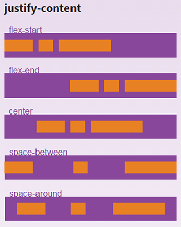

# CSS - Reference

## +@media Query
```css
@media (min-width: 400px) and (max-width: 700px) { … }
@media (min-width: 20em) { … }
@media (orientation:portrait) { … }
@media (device-width < 800px) { … }
@media (device-aspect-ratio: 16/9) { … }
@media (device-aspect-ratio: 32/18) { … }
@media (device-aspect-ratio: 1280/720) { … }
@media (device-aspect-ratio: 2560/1440) { … }
@media (resolution >= 2dppx)
@media (grid) and (max-width: 15em) { … }
```
<br>

#### To change the background and text color in different lighting conditions you would write something like this
```css
@media (luminosity: normal) {
    body {
        background: #f5f5f5;
        color: #262626;
    }
}
@media (luminosity: dim) {
    body {
        background: #e9e4e3;
    }
}
@media (luminosity: washed) {
    body {
        background: #ffffff;
    }
}
```
<br>

 
#### For accessibility purposes, user agents may offer manual controls allowing the user to switch between the 3 levels of independently of the ambient light level, as high contrast or low contrast styles may be more suitable for users with visual disabilities.
```css 
@media (light-level: normal) {
  p { background: url("texture.jpg"); color: #333 }
}
@media (light-level: dim) {
  p { background: #222; color: #ccc }
}
@media (light-level: washed) {
  p { background: white; color: black; font-size: 2em; }
}
```

#### The media feature device-aspect-ratio only applies to visual devices. On an speech device, expressions involving device-aspect-ratio will therefore always be false:
```html
<link media="speech and (device-aspect-ratio: 16/9)" rel="stylesheet" href="example.css">
```
<br>


#### For accessibility reasons, even on devices whose pointing device can be described as fine, the UA may give a value of coarse or none to this media query, to indicate that the user has difficulties manipulating the input device accurately or at all.
Make radio buttons and check boxes larger if we have an inaccurate pointing device
```css
@media (pointer:coarse) {
  input[type="checkbox"], input[type="radio"] {
    min-width:30px;
    min-height:40px;
    background:transparent;
  }
}
```
<br>

#### For accessibility reasons, even on devices that do support hovering, the UA may give a value of hover: none to this media query, to opt into layouts that work well without hovering.
Only use a hover-activated drop down menu on devices that can hover.
```css
@media (hover) {
  .menu > li {display:inline-block;}
  .menu ul {display:none; position:absolute;}
  .menu li:hover ul {display:block; list-style:none; padding:0;}
}
```
<br><br><br>

# CSS Rule

- If two div nested in parent and child relation then child div cover parent div, to see parent div color, then give padding to parent div.

- Block element take full width of parent, if we give width less than parent div, then next sibling element will not come beside previous element.
- Inline Element always align next to each other
- Many elements has default margin and may change as per browser. To solve this use CSS Reset for cross-browser compatibility.
- Difference between display: block, inline, inline-block


- **Collapse or Overlap Margin** <br>
**Without Float** – : If two elements has margin 10px, then gap between them will be 10px, not 20px. Or whichever element has higher margin, gap will be that much.<br>
<br><br>
**With Float – :** If two elements has margin 10px, then gap between them will be 20px. In float margin never overlap, if two element has 10px and 20px then gap will 30px.<br> 
**margin-top:10px, <br> margin-bottom:10px**<br>
<br><br> 
margin-top:10px, <br> margin-bottom:10px <br> and .orange{margin-bottom:30px;}<br>
<br><br> 
margin-top:10px, <br> margin-bottom:10px <br> and .orange{margin-bottom:30px;}  <br> .green{margin-bottom:30px;}<br>
<br><br>
margin-top:10px, <br>margin-bottom:10px <br>and .orange{margin-right:30px} <br>
<br><br>
margin-top:10px, <br>margin-bottom:10px <br>and .orange{margin-bottom:30px; margin-right:30px} <br>
<br>

- **Padding and Margin Never Overlap -** <br>
if parent div has padding 10px and child div has margin 10px then inner gap between child and parent will be 20px; **this work same when child has float.** child has **margin-top:10px, margin-bottom:10px** and parent has **padding:10px** <br>
**without child float**<br>
<br><br>
**with child float**<br>
<br>

- First and Last Child Margin apply to Parent - if parent don’t have padding, border and overflow:hidden then first and last child margin apply to its parent child.
- Overflow:hidden and border  is help to parent div by restrict for applying child div margin to parent if parent div don’t have padding.
- If div tag are empty then it will not render and will not take space in html.
- Turn Inline element to block level by display:block; and block element to  inline by display:inline;
- Inline element you can’t give width, width not effect on inline element. if you give float:left to inline element then inline element start floating + start behaving like Block level element, now margin, overlap margin, width will work.
- If you give width:auto to block element, it will not expand according to child element,  its will always take parent width.
- if you give padding to Inline element and parent is block element then inline element expand more than parent height, expand from top and bottom, but parent div position never change from top and not effect of parent border, Border and Padding doesn’t solve this, Overflow hidden only mask expanded area but doesn’t solve this.<br> 


- if you give Margin to Inline element then only Left, Right margin will work     and     Top, Bottom margin will ignor<br>


- float left <br>
if Orange is block and float left element, and Green n Blue are only block element then float will work like below and all three are in child of one parent<br>
<br>
<br>
<br>
<br>
<br><br>
if Orange element float:right<br>
<br><br>
if Blue element given clear:left<br>
<br><br>
if one more Orange element added below to Blue element with same Orange styles<br>
<br><br>
if Blue element remove clear:left<br>
See, mark, observe in below and above – float element will start floating below after its previous block element, if previous is also float element then they reside side by side.<br>
<br><br>
if Blue is out of parent and Blue element remove clear:left <br>
<br>
<br><br>
if Blue element give clear:left, but white gap come<br>
<br><br>
to solove white gap give Red parent element overflow:hidden<br>
<br><br>
If we give float:left to element then clear:left will work,
ane if give float:right to element then clear:right will work,
to solve this use clear:both<br>
When a block-level element is floated, its width is calculated based on the width of the content inside it

- Box Model – Block element width increase according to  padding, border, margin.<br>


- To fix Box Model issue use box-sizing:border-box, if parent width:300px and 3 child has width:100px, padding:3px, float:left; then child width will be 103px by box modelling and last child will fall down,.<br>
<br>
<br>  
to solve this use box-sizing:border-box to child so child width be 100px including padding<br>
<br>
<br>

- **Absolute** <br>
if parent div has default property position:static and child div is position:absolute + doesn’t set top, left then it will align to parent div’s top left according to parent padding.<br>
<br>
check below, Orange div set position:absolute and doesn’t set top left<br>
<br>
check below, now Orange div set position:absolute and top:0px; left:0px;
in this case Orange div will check parent’s parent div position property,
if its relative or absolute then orange div will align to it
if not then again check parent’s parent till body.<br>
<br>
margin will apply to absolute element but will not work like overlap margin.
margin value will effect from left and top of that element

- Block Element are  **ul, Table,  div, dl, fieldset, form, h1, h2, h3, h4, h5, h6, hr, li, main, nav, address, blockquote, dd, noscript, ol, p, pre**
- Bolck HTML5 Element are **article, aside, canvas, figcaption, figure, footer, header, hgroup, tfoot, output, section, video**
- Inline Element **a, b, strong,  big, i, img, small, button, input, span, textarea, label, map, select,  acronym, cite, code, dfn, em, kbd, samp, time, var, bdo, br, object, q, script,  sub, sup**
<br><br><br>


# CSS Specificity
When two or more CSS selectors are sending conflicting instructions to a single html element, a choice must be made as to which styles to apply. This is done through CSS specificity.
Blow is given value for
```javascript
Style Attribute  = 1000
ID = 100
Class, pseudo-Class = 10
Elements = 1
```

**For Remeber**
```javascript
- - - - - - - - - - - - - - - - - - - - - - - -
Style Attribute          1    0    0    0
- - - - - - - - - - - - - - - - - - - - - - - - 
ID                            1    0    0
- - - - - - - - - - - - - - - - - - - - - - - -  
Class, pseudo-Class                1    0
- - - - - - - - - - - - - - - - - - - - - - - - 
Elements                                1
- - - - - - - - - - - - - - - - - - - - - - - - 
```

**Below is calculation**
```css
p   ➔   1
div    ➔ 1
#sidebar    ➔ 100
div#sidebar   ➔ (div - 1) + (#sidebar - 100)  ➔   100 + 1  ➔ 101
div#sidebar p   ➔ (div – 1) + (#sidebar  - 100) + (p – 1) ➔  1 + 100 + 1  ➔ 102
div#sidebar p.bio   ➔  (div – 1) + (#sidebar  - 100) + (p – 1) + (.bio – 10) ➔  112
```

```css
height:500px !important /*will ignore all css and set this important css*/
```
- - -  

<br><br>


# CSS Aligment

### Block Element’s inner content align center
```css
div {text-align:center;}
```
<br><br>
### Vertical and Horizontal Alignment
Horizontal Centering Block Level Elements
```css
div#container {margin:0 auto;}
```
<br><br>

### Vertical and Horizontal Centering Block Level Elements, 
left, top, margin-left, margin-top
```css
div#container {
    position: absolute; 
    top: 50%; left:50%; 
    width:800px; height: 500px; 
    margin-left: -400px;  margin-top: -250px;  border:#ff0000 solid thin;
}
```
<br><br>


### Vertical  and Horizontal Centering position:absolute
left, top, margin-left, margin-top
```css
.n_content{ 
    position:absolute; top:0; bottom:0;
    left:0; right:0;
    max-width:500px; height:200px; 
    margin:auto; 
    color:#fff;
}
```
<br><br>

### Vertical Centering Div Text with Line-Height
The HTML:
```html
<div id="container">some text here</div>
```
The CSS:
```css
div#container {height: 35px; line-height: 35px}
```
<br><br>


### Vertical Horizontal Center Div Text  with Padding, but increase button size according to text font size
```css
.parent{ 
    display: inline-block; 
    text-align:center; 
    padding: 10px 20px;  
    font-size: 50px;  
    background-color: #ff0000;
} 
```
```html
<a class="parent">Shailendra</a>
<a class="parent">more</a>
```
<br><br>


### Vertical Horizontal Center Div Text with “table” and “table-cell”, button size does not Increase according to text font size
CSS:
```css
.parent{
  display: table; width:350px; height:120px;
  margin: 2px; text-align:center; float: left;  
  background-color: #ff0000;
}
span{  
  display: table-cell;  
  vertical-align: middle;  
  font-size: 50px;
}
img{  
  vertical-align: middle;
}
```
HTML:
```html
<div class="parent">
  <span>Shailendra</span>
</div>
<div class="parent">
  <span>More</span>
  <span></span>
</div>
```
<br><br>


### Align Text and element Vertical bottom
```css
vertical-align: bottom;
```
----------
<br><br>

# Text and Font
### Text-transform
Through the CSS text-transform property you can make sure certain blocks of text are either uppercase, lowercase, or only the first letter of each word is uppercase
```css
p {text-transform: uppercase}
p {text-transform: lowercase}
p {text-transform: capitalize}
```
<br>

### Remove Dotted Outline on Links
Easy with the CSS outline property (underline, line, doted line)
```css
a {outline: none}
//or 
a {outline: 0}
```
The outline is useful for accessibility so think twice before turning it off completely. You may only want to set it for one of the specific link states mentioned above.

<br><br>
### Text font size increase according to Viewport Width and Height, in percentage
text increase according to Viewport Width
```css
.parent{
  font-size: 10vw;
}
```

Text increase according to Viewport Height
```css
.parent{
  font-size: 10vh;
};
```
<br><br>

### Prevent a Line Break
Sometimes the text in a link or heading will break where you don’t want it to. A simple way to prevent this is:
```css
h1 { white-space:nowrap; }
```

<br><br>

### Style the Element that has Focus in a Form
A nice usability tip is to let people filling out a form know which input currently has focus. You can do this easily using the :focus pseudo-selector
```css
input:focus {
  border: 2px solid green;
}
input:focus { 
  background-color: yellow;
}
```
This way your users will know exactly which field is ready for input


----------
<br><br>
# Image

### Removing the Border from Image Links
By default any image that is wrapped in a link will have a border around the image (similar to the way text is underlined). Removing the border is simple
```css
a image {border: none}
//or 
a image {border: 0}
```
Since I never want to see the border around image links I usually set the above on every site I develop.

----------
<br><br>
# Background 
### Background Images as List Bullets
Sometimes it’s nice to be able to use an image as a bullet instead of one of the supported list-style-types.
```css
ul {list-style: none}
ul li {
    background-image: url("path-to-your-image");
    background-repeat: none;
    background-position: 0 0.5em;
}
```


----------
<br><br>

# CSS Width and Height
### Increase Decrease width to Specific Limit
In below CSS width will increase and decrease according to parent width **below 800px.** Above parent width 800 element will stick to 800px;
```css
.imgC{
  display:block; margin:0 auto; height:auto;
  width:800px; max-width:100%;
}
```

In below CSS width will increase and decrease according to parent width **above 800px**. Above parent width 800 element will stick to 800px;
```css
.imgC{
  display:block; margin:0 auto; height:auto;
  width:800px; min-width:100%;
}
```
<br><br>

### 100% Height
When you specify an element to have a height of 100%, the 100% refers to the parent element’s height. The parent element would then need to be 100% the height of its parent element and so on. The trick is to set the height of the outermost elements to be 100%
```css
html, body {
  height: 100%
}
```
We need to add one more thing. If your content exceeds 100% height then it will overflow its container. To correct this we’d need to set min-height on the content’s container
```css
#content {
  min-height: 100%
}
```
You can use one of the methods above for serving min-height to IE.

<br><br>

### Change Height in proportion to Width of DIV
```html
//---- H T M L -----------
<div class="box" id="redBox">
    <div class="padder"></div>
</div>
```
```css
//---- C S S ----------
/*
Box div height will change in proportion to Box width
*/
.box {
    position:relative;
    width:300px;
    height:auto;
    background:url(../images/spritesheet-img.png);      
} 
/* if width 250px and height 300px then padding-bottom will be as per below.
padding-bottom = height*100/width
padding-bottom = 300*100/250
padding-bottom = 120           */
.padder{
  padding-bottom:120%;
}
```


----------
<br><br>

# CSS Viewport
### Viewport Meta Tag
```html
<meta name="viewport"
    content="width=device-width, height=device-height, maximum-scale=1.0, minimum-scale=1.0, initial-scale=1.0, user-scalable=no" />
```

<br><br>
### Block search indexing with 'noindex', stop crawling website
To prevent most search engine web crawlers from indexing a page on your site, place the following meta tag into the 
```html
<!DOCTYPE html>
<html>
  <head>
    <meta name="robots" content="noindex, nofollow">
  </head>
  <body></body>
</html>
```
----------
<br><br>

# CSS Floats
### Clearing and Containing Floats
There are two basic methods to clearing CSS floats. The first is to use the clear property
```html
<div id="wrapper">
  <div id="header"></div>
  <div id="content"></div>
  <div id="sidebar"></div>
  <div id="footer"></div>
</div>
```
Say in the above html you have your content and sidebar div floated to the left and you want to ensure the footer div sits below both. You would use the clear property
```css
#content {float: left}
#sidebar {float: left}
#footer {clear: both}
```

You could also use clear: left or clear: right depending on which way the content and sidebar are floated.

If on the other hand your html is:
```html
<div id="header">
	
	<p id="tagline"></p>
</div>
```
and both the logo and tagline are floated, your header div will collapse and show as having 0 height. You can either add an empty div 
```html
<div class="clear"></div>
```
 and then clear the empty div as above 
 
 or 
 
 you can use the overflow property on the header div to contain the floated elements
```css
div#header {overflow: hidden}
```
The above will keep the header div from collapsing even if everything inside has been floated.

----------
<br><br>

# Flex-Flow
https://css-tricks.com/snippets/css/a-guide-to-flexbox/

<br><br>
<br><br>
<br><br>
<br><br>
<br><br>
<br><br>
<br><br>


### Flex Occupy / Expand remain height
```css
.parent{
  display:flex; flex-direction: column;
  .topDiv{
    height:50px;
  }
  .bottomDiv{
    flex:1;
  }
}


```


----------
<br><br>

# Misc
### Visibility or Display?
On the surface both the CSS visibility and display properties seem to do the same thing, hide or show an element on the page. Beneath the surface they work differently.
```css
{visibility: hidden} – 
/*The element holds the space, but isn’t seen*/

{display: none} – 
/*The element does not hold space. Other elements collapse to fill the space*/
```
Most of the time you likely want to use display: none, unless your goal is to leave an empty open space on your page.

<br><br>

### nth-child
See also below link for more clarification : 
http://www.w3schools.com/cssref/sel_nth-child.asp, 
http://www.w3schools.com/jquery/sel_nthchild.asp
The nth-child CSS pseudo-selectors allow you to target the 3rd or 7th or nth element in a list. Another use would be to style odd and even rows in a table differently. The alternative is to add a class specifically to the list-item you want to style differently, but that’s not very flexible. The nth-child syntax looks like this:
```css
ul li:nth-child(3) {
    background: blue
}
```
The above would select the 3rd item in the list and give it a blue background
```css
ul li:nth-child(3n+3) {
    background: blue
}
```
Similarly the code above would style every 3rd list item with a blue background
Unfortunately no current version of IE supports it. However there is a way to simulate the 1st bit of code above for IE7 and IE8.
```css
ul > li:nth-child(3) is the same as ul > *:first-child + * + * 
```
The code above will also target the 3rd element in the list in a way that IE7 and 8 understand. Not quite as useful as being able to use (3n+3) to target every 3rd list-item, but better than nothing. Hopefully IE9 will support nth-child.
Another and perhaps more practical solution currently is to use jQuery, which supports all CSS3 selectors.

<br><br>

### Conditional Comments
Conditional comments are an ideal way to target IE browsers only, since IE is often the browser that won’t cooperate. The basic form of a conditional comments is:
```css
<!--[if IE]>
	<link rel="stylesheet" type="text/css" href="ie-stylesheet.css" />
< ![endif]-->
```
The above will load an IE specific stylesheet only when the browser viewing the page is Internet Explorer. You can further target specific versions of IE.
```css
<!--[if IE 6]> - targets IE6 only -->
<!--[if gt IE 6]> - targets IE7 and above -->
<!--[if lt IE 6]> - targets IE5.5 and below -->
<!--[if gte IE 6]> - targets IE6 and above -->
<!--[if lte IE 6]> - targets IE6 and below -->
```
You can specify any version of Internet Explorer and through a combination of conditional comments you can server different CSS styles to different versions of IE.

<br><br>


### HTML Hack for IE
Another way to target IE specifically is to use the HTML * hack. Internet Explorer allows you to use something other than the html element as the root of your document. By placing an * in front of html in your CSS (*html) you can target IE only as other browsers will ignore the declaration.
div#content {width: 580px}
```css
*` html body div#content {width: 600px}
```
IE will use 600px for the width of the content div, while other browsers use 580px. The above works for IE6 and below. When not in standards mode, but in quirks mode this will work on IE7 as well. You can also target IE7 (in quirks mode) specifically with
```css
*+html body div#content {width: 620px}
```

<br><br>

### Target IE7 (and below) and IE6 (specifically) without Conditional Comments
We all know how difficult IE can sometimes be when it comes to CSS. However instead of cursing IE under your breath or out loud you can easily write IE specific code that other browsers will ignore. My own preference is for conditional comments, but here’s a quick trick you can use in your main CSS file.
```css
.element {
    background: red; /* modern browsers */
    *background: green; /* IE 7 and below */
    _background: blue; /* IE6 exclusively */
}
```
With the exception of IE, all browsers will ignore the asterisk in front of the property. Everything other than IE6 will ignore the underscore. The order of the above properties is very important due to CSS precedence rules.

<br><br>

### Min-height fix for IE
Sadly IE still doesn’t comply with min-height. However it does treat the height property as though it was min-height. Knowing that, we can sort of get min-height working in Internet Explorer.
```css
.element {
    min-height: 500px
    height: auto !important
    height: 500px
}
```
The first line above sets the min-height for non-IE browsers. The last line essentially sets min-height in IE as IE will treat height as we expect it to treat min-height. The middle line above is to ensure that non-IE browsers don’t use 500px as the height of the element. Using !important will override the height declaration below in all browsers, except IE.
Another way to target IE only is to use _height. Only IE6 will treat _height as height. All other browsers will ignore it. You have to specify _height after any height declaration as IE will use whichever comes last.
```css
.element {
    min-height: 500px
    _height: 500px
}
```


### Mouse click (or touch) events on canvas causes selection drag
```css
#canvas {
	-webkit-tap-highlight-color: transparent;
}
```
<br><br>

### Avoid Ghost Image Selection
```css
.noselect {
	-webkit-touch-callout: none;
	-webkit-user-select: none;
	-khtml-user-select: none;
	-moz-user-select: none;
	 -ms-user-select: none; 
	-o-user-select: none; 
	user-select: none;
	outline: none; 
	text-decoration:none; 
	outline:none; 
	outline-color:none;
}
```
<br><br>


### Using a CSS Reset for Cross-Browser Compatibility
One of the issues in cross-browser web development is that different browsers use different default values for various CSS properties. By explicitly setting a property like margin to be 0 for certain html elements we can assure that the margin will be 0 on that element in all browsers.
Using a CSS reset ensure that all browsers are on the same page so to speak.
```css
*{
	margin:0; padding:0;
}
```
**//---- or ---------**
```css
*{ -webkit-box-sizing: border-box;   -moz-box-sizing: border-box;  box-sizing: border-box;}
h1, h2, h3, h4, h5, h6, p, div, ul { margin:0; padding:0; font-weight:normal; line-height:100%;}
a{ text-decoration:none; outline:none; }
*:focus{outline:none;}
ul{list-style:none;}
img { border:0; vertical-align:middle;}
body { margin:0; padding:0; font-family:'FuturaLtBTLight', Arial, Helvetica, sans-serif; color:#ffffff; width:100%;  }
input[type="button"]{cursor:pointer;}
.clear { clear:both; margin:0; padding:0; }
.clearfix:after {content: " "; /* Older browser do not support empty content */ visibility: hidden; display: block; height: 0; clear: both;}

.overFlow{ overflow-x:hidden;}
svg, canvas{ pointer-events: none;}
p{ font-size:14px; line-height:27px; color:#393939;}
.f-left{float:left;}
.f-right{float:right;}
.Text-align-left{ text-align:left;}
.Text-align-right{ text-align:right;}

```
<br><br>

### 3D Buttons with CSS Only
```css
div#button {
  background: #888; 
  border: 1px solid; 
  border-color: #999 #777 #777 #999;
}
```

<br><br>
### CSS Tooltips

You can create a lightweight CSS cross browser tooltip easily with a few lines of code.
This is the  `<a class="tooltip" href="#">Tooltip Link<span>` This will be the text that shows up in the tooltip`</span></a>` You can place any text you want here.
The CSS:
```css
a.tooltip {position: relative}
a.tooltip span {display:none; padding:5px; width:200px;}
a:hover {background:#fff;} /*background-color is a must for IE6*/
a.tooltip:hover span{display:inline;  position:absolute;}
```
You can add more styles to the above to suit your design. The key is the span is set to display: none until you hover over the link. When you hover over the link the display is changed to show inline and given a position of absolute. position: relative is necessary on the link in order to ensure the tooltip is positioned in relation to the link and not another containing element.


<br><br>
### Video Tag and its Parameter
below code help to auto play video in mobile them
```html
<video class="contact-video" poster="img/team-poster.jpg" data-object-fit="cover" muted  loop  webkit-playsinline  playsinline >
<source src="img/Team_low.mp4" type="video/mp4">
Your browser does not support the video tag.
</video>
```


----------
<br><br>

# JAVASCRIPT

### Mobile Detection Code
Object Version
```javascript
this.isMobile = {};
this.isMobile.Android = function() {return navigator.userAgent.match(/Android/i);};
this.isMobile.BlackBerry = function() {return navigator.userAgent.match(/BlackBerry/i);};
this.isMobile.iOS = function() {return (navigator.userAgent.match(/iPhone|iPad|iPod/i) ||
  (navigator.platform === 'MacIntel' && navigator.maxTouchPoints > 1));};
this.isMobile.iPad = function() {return (navigator.userAgent.match(/iPad/i) ||
  ((navigator.platform === 'MacIntel' && navigator.maxTouchPoints > 1) && window.screen.width==768));};
this.isMobile.Opera = function() {return navigator.userAgent.match(/Opera Mini/i);};
this.isMobile.Windows = function() {return navigator.userAgent.match(/IEMobile/i);};
this.isMobile.Firefox = function() {return navigator.userAgent.match(/Firefox/gi);};
this.isMobile.InternetExplorer = function() {return navigator.userAgent.match(/MSIE/gi);};
this.isMobile.Opera = function() {return navigator.userAgent.match(/Opera/gi);};
this.isMobile.Safari = function() {return navigator.userAgent.match(/Safari/gi);};
this.isMobile.any = function() {return (This.isMobile.Android() || This.isMobile.BlackBerry() || This.isMobile.iOS() || This.isMobile.Opera() || This.isMobile.Windows());};
```
Normal Version
```javascript
var isMobile = {};
isMobile.Android = function() { return navigator.userAgent.match(/Android/i);};
isMobile.BlackBerry = function() { return navigator.userAgent.match(/BlackBerry/i);};
isMobile.iOS = function() { return (navigator.userAgent.match(/iPhone|iPad|iPod/i) ||
  (navigator.platform === 'MacIntel' && navigator.maxTouchPoints > 1))};
isMobile.iPad = function() { return (navigator.userAgent.match(/iPad/i) ||
  ((navigator.platform === 'MacIntel' && navigator.maxTouchPoints > 1) && window.screen.width==768))};
isMobile.Opera = function() { return navigator.userAgent.match(/Opera Mini/i);};
isMobile.Windows = function() {return navigator.userAgent.match(/IEMobile/i);};
isMobile.Firefox = function() {return navigator.userAgent.match(/Firefox/gi);};
isMobile.InternetExplorer = function() {return navigator.userAgent.match(/MSIE/gi);};
isMobile.Opera = function() {return navigator.userAgent.match(/Opera/gi);};
isMobile.Safari = function() {return navigator.userAgent.match(/Safari/gi);};
isMobile.any = function() {
  return ( isMobile.Android() || isMobile.BlackBerry() || isMobile.iOS() || isMobile.Opera() || isMobile.Windows());
};
```
<br><br>

### Shuffle Array, Set a random order
```javascript
function shuffleToArray(OldArray) {
    var i = 0;
    var TempArray = [];
    while (i < OldArray.length) {
        var ran = Math.floor(Math.random() * OldArray.length);
        TempArray.push(OldArray[ran]);
        OldArray.splice(ran, 1);
    }
    return TempArray;
};
var array = ["apple", "mango", "orange", "coconut"];
array = shuffleToArray(array);
```

<br><br>

### SpriteSheet Background Image Animation
You can play SpriteSheet image animation using background-image css property in div. You can control animation by `Play`, `Pause`, `Restart`, `Reverse`, `Loop`, `Speed`, `gotoAndStop` and `gotoAndPlay`.

check [sprite-sheet-background-image-animation](https://github.com/shailendra/sprite-sheet-background-image-animation) github library.

<br>
----------
<br><br>

# Location, Query, 

### Get Query String Parameters
```javascript
// Assume "?post=1234&action=edit"

var urlParams = new URLSearchParams(window.location.search);

console.log(urlParams.has('post')); // true
console.log(urlParams.get('action')); // "edit"
console.log(urlParams.getAll('action')); // ["edit"]
console.log(urlParams.toString()); // "?post=1234&action=edit"
console.log(urlParams.append('active', '1')); // "?post=1234&action=edit&active=1"
```
URLSearchParams also provides methods like keys(), values(), and entries():

```javascript
var keys = urlParams.keys();
for(key of keys) { 
  console.log(key); 
}
// post
// action

var entries = urlParams.entries();
for(pair of entries) {
  console.log(pair[0], pair[1]);
}
```
JavaScript Fallback of **URLSearchParams**
```javascript
function getUrlParameter(name) {
    name = name.replace(/[\[]/, '\\[').replace(/[\]]/, '\\]');
    var regex = new RegExp('[\\?&]' + name + '=([^&#]*)');
    var results = regex.exec(location.search);
    return results === null ? '' : decodeURIComponent(results[1].replace(/\+/g, ' '));
};
```
With the function above, you can get individual parameter values:

```javascript
getUrlParameter('post'); // "1234"
getUrlParameter('action'); // "edit"
```
<br><br>

### Scroll to Div as per Hash/Anchor - Query, Address, Url
below code find `a` tag element by matching hash value from url and href value from `nav a`. Then it trigger `click` event and html scroll to specific section. 

```javascript
var hash = location.hash;
if(hash!=""){
    var nHash = hash.split("?")[0];
    var btn = $('nav a[href="'+nHash+'"]');   
    if(btn.trigger){
        btn.trigger("click");
    }    
}
```


----------
<br><br>

# Youtube

### Live chat
Youtube live chat iframe embed code
```html
<iframe src="https://www.youtube.com/live_chat?v=EEIk7gwjgIM&embed_domain=www.example.com" width="700" height="600" style="position:absolute; top:0; left:0; z-index:99;"></iframe>
```
<br><br>


# Google Analytic
### Send Section View using #!section_id to googletagmanager 

```javascript
var lastHasTag = "";          
var sectionArrayNew = [];
sectionArrayNew.push({id:"home"});
sectionArrayNew.push({id:"quick_dissolve"});
sectionArrayNew.push({id:"why_choose_madhur"});
sectionArrayNew.push({id:"gaurantee_5s"});
sectionArrayNew.push({id:"pristine_sweetness"});
sectionArrayNew.push({id:"untouched_by_hand"});
for (var k = 0; k < sectionArrayNew.length; k++) {
    var obj = sectionArrayNew[k];
    var id = obj.id;
    var hash = "#"+id;
    var hashForGATag = "#!"+id;
    var targetSection = $(hash);
    obj.anchor = targetSection;
    obj.hash = hash;
    obj.targetSection = targetSection;
    obj.hashForGATag = hashForGATag;
}
function redrawDotNav(){  
    var wTop = $(window).scrollTop()+$(window).height()/2;
    var curSectObj = null;
    for (var i = 0; i < sectionArrayNew.length; i++) {
        var secObj = sectionArrayNew[i];
        var targetSection = secObj.targetSection;                    
        var top = targetSection.offset().top;
        var height = targetSection.height();  
        if(wTop>=top && wTop<=(top+height)){
            curSectObj = secObj;
        } 
    } 
    if(curSectObj)  {      
        if(lastHasTag!=curSectObj.hashForGATag){
            lastHasTag = curSectObj.hashForGATag;
            clearTimeout(window.intervalIdForHas)
            window.intervalIdForHas = setTimeout(function(){
                gtag('config', 'UA-xxxxxxxxx-1', { 'page_path': location.pathname +curSectObj.hashForGATag });
            }, 1500)
        }
    }
} 
redrawDotNav(); 
$(window).bind("scroll", redrawDotNav);

```
<br><br><br>
---
# Ajax, Form, Post, Get

### AES CryptoJS Encrypt & Decrypt With ASP.Net
Below is example of Ajax call with AES encrypted data.<br>

***---------  JavaScript Code ---------*** 
```javascript
var backendPath = "https://xyz.com/backend/";
var k1 = "xzxzxzxzxxzxzxzx";
var cryptoKey = CryptoJS.enc.Utf8.parse(k1);
var cryptoIV = CryptoJS.enc.Utf8.parse(k1);
var cryptoParam = {
    keySize: 128 / 8,
    iv: cryptoIV,
    mode: CryptoJS.mode.CBC,
    padding: CryptoJS.pad.Pkcs7
}
function cryptoEncrypt(prop){
    var str_1 = prop.str.replace(/[{]/g, "curleyfront");
    var str_2 = str_1.replace(/[}]/g, "curleyback");
    var encryptedString = CryptoJS.AES.encrypt(CryptoJS.enc.Utf8.parse(str_2),cryptoKey, cryptoParam).toString();
    return encryptedString;
}
function  cryptoDecrypt(prop){
    var decryptStr = CryptoJS.enc.Utf8.stringify(CryptoJS.AES.decrypt(prop.str, cryptoKey, cryptoParam));
    var str_1 = decryptStr.replace(/curleyfront/g, "{");
    var str_2 = str_1.replace(/curleyback/g, "}");
    return str_2;
}
function sendPostRequest(prop) {
    var url = ""; 
    if (prop.service){
        url = backendPath + prop.service;
    } else if (prop.url){
        url = prop.url;
    } 
    var encryptedStr = cryptoEncrypt({str:prop.formData});
    var newEncryptedObj = { d: encryptedStr };
    var newJSONStr = JSON.stringify(newEncryptedObj);

    function success(response){
        //console.log("response --- ", " - ", response);
        var encryptedStr = JSON.parse(response).d;
        var actualJsonStr =  cryptoDecrypt({str:encryptedStr});
        //console.log("actualJsonStr --- ", " - ", actualJsonStr);
        var data = JSON.parse(actualJsonStr);
        //console.log("data --- ", " - ", data);
        if(prop.resolve){            
            prop.resolve(data);
        }
    }
    function error(response){
        //console.log("errorResponse - ", response);        
        if(prop.reject){            
            prop.reject({ success: false, data: response });
        }
    };
    function complete(data){
    };
    var ajaxOption = {
        method: prop.method?prop.method:"GET", 
        data: newJSONStr,
        url:url,
        crossDomain: true, 
        contentType: prop.contentType?prop.contentType:"application/x-www-form-urlencoded; charset=UTF-8",
        dataType: prop.dataType?prop.dataType:"text",
        success: success,
        error:  error,
        complete:complete
    }
    if(prop.contentType!=undefined){
        ajaxOption.contentType = prop.contentType;
    }
    if(prop.datatype!=undefined){
        ajaxOption.datatype = prop.datatype;
    }
    //console.log(ajaxOption);
    $.ajax(ajaxOption);
}
//-----------------------------------------------------------------------
//------ L O A D   J S O N   U S I N G   G E T   M E T H O D  -----------
var ajaxOption = {
    url: "assets/json/basicData.json",
    formData:"{}",
    dataType:"text",
    resolve:function(jsonObj){}, 
    reject:function(jsonObj){}
}
sendPostRequest(ajaxOption);
//---------------------------------------------------------------------------
//--- S E N D   &  L O A D   J S O N   U S I N G   P O S T   M E T H O D  ---
var ajaxOption = {
    formData:JSON.stringify(formData),
    service: "basicdetails",
    method:"POST",
    contentType: "application/json; charset=utf-8",
    dataType:"text",
    resolve:function(jsonObj){}, 
    reject:function(jsonObj){}
}
sendPostRequest(ajaxOption);
```
<br>

**--------- PHP Code ---------**


**--------- ASP.Net Code ---------**